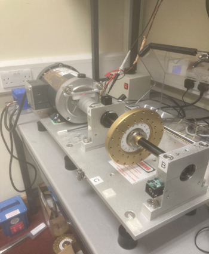
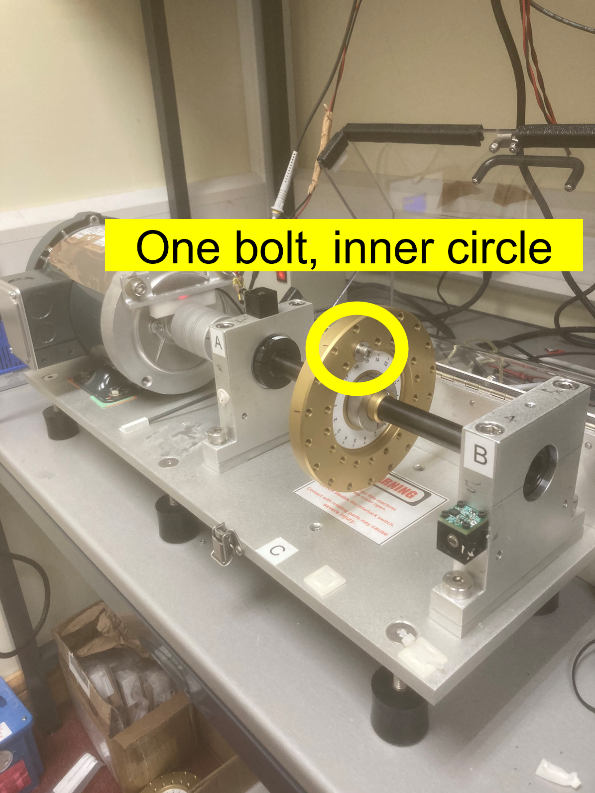
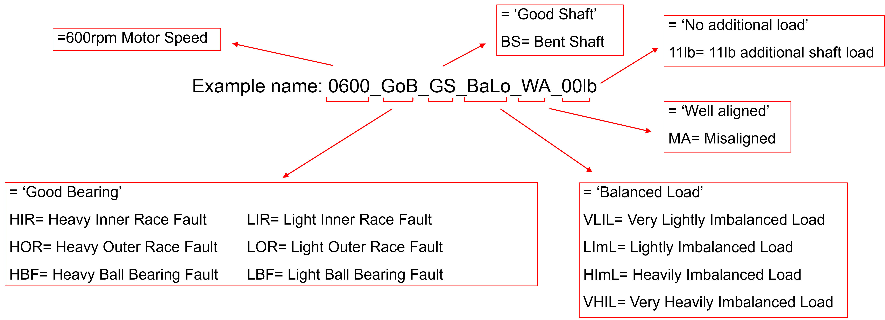
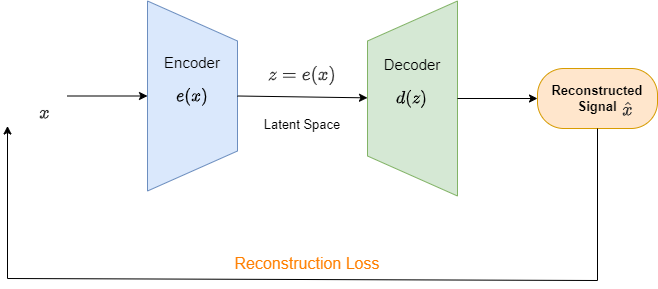
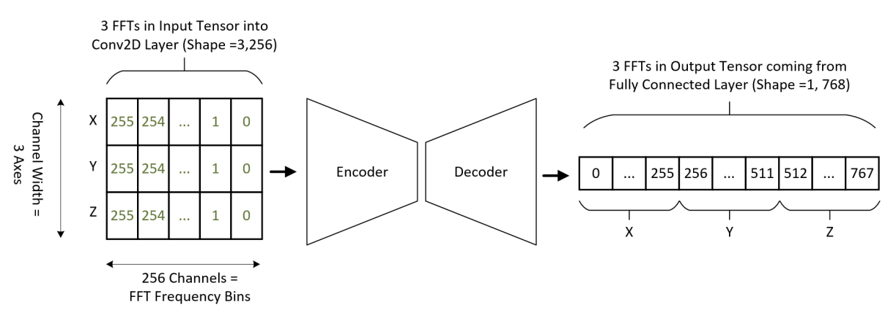
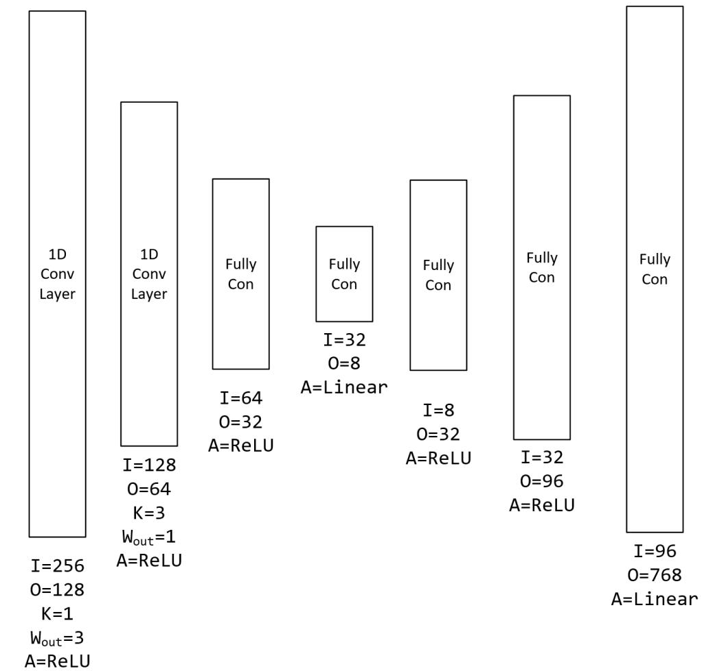
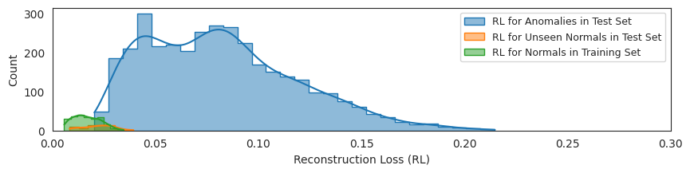
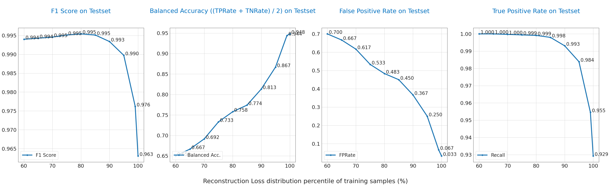

# Motor Fault Detection at the Edge using MAX78000, A Case Study with: SampleMotorDataLimerick Dataset

Gulnur Selda Uyanik, Asya Turhal, Gorkem Ulkar

## Overview

Condition-based monitoring (CbM) is the automated monitoring of equipment conditions. This process includes collecting sensory data and applying algorithms or machine learning techniques to predict the health status of the equipment. Equipment of interest is usually motors participating in many industrial applications, as in this paper.

The unsupervised nature of CbM models comes from the fact that the unhealthy, a.k.a. faulty data types, are hard to collect with varying types of operations. Hence, only healthy data is used for model training and several fault types are tested for detection performance.

The following sections will present the fault detection system for the edge devices. The designed model is trained, deployed, and verified on MAX78000 EVkit. Model performance is verified and evaluated using in-house sample motor data available from:

## Dataset Information

### Raw Data Properties

Sample motor data is collected using SpectraQuest Machinery Fault Simulator that has general setup view: 

    

Faults tested include a variety of mechanical faults as follows:

- Very Light Imbalance
- Light Imbalance
- Heavy Imbalance
- Very Heavy Imbalance
- Bent Shaft
- Misaligned Shaft (Angular)
- Light Inner Race Fault
- Heavy Inner Race Fault
- Light Outer Race Fault
- Heavy Outer Race Fault
- Light Ball Bearing Fault
- Heavy Ball Bearing Fault

For the imbalance faults, varying loads are placed in the setup, sample can be seen as follows:

    

For the other fault types, details can be seen from the below Figure:

    

Each fault was tested at 600, 1200, 1800, 2400 & 3000 RPM and tested both with and without an additional 11lb load on the shaft. ADXL356 sensor data is used for vibration raw data.

For ADXL356 sensor, the sampling frequency was **20kHz** and data csv files recorded for **2 sec** in X, Y and Z direction.

Data files are saved in.csv format with the following naming convention:

    

### Data Loader Design

Data loader handles all the data related tasks for proper model training such as raw data pre-processing, windowing, type casting etc.

The signal pre-processing flow starts with a windowing of continuous signal using 0.25 seconds-long segments with overlapping approach (with 0.75 ratio set) for each raw data csv file including 2 seconds of vibration data.

Data loader implementation resides in [training repository](https://github.com/MaximIntegratedAI/ai8x-training/), (`datasets/samplemotordatalimerick.py`). Each functionality is described in the following sections:

#### Data Pre-processing

Data pre-processing steps include downsampling of the signal, windowing approach, FFT operation and scaling.

**Downsampling:**

The raw data sampling rate is 20 KHz and the initial pre-procesisng step is downsampling with factor 10 providing 2 KHz sampling rate for the latter processing.

**FFT:**

 As both the fault effects and rotation characteristics are more visible to track in the frequency domain, windowed signals are then input to FFT. Power normalization inside the window, for each frequency bin is also applied.

**Scaling:**

All samples are scaled on a per sample, per axis basis such that each of the X, Y & Z FFTs all have the same minimum and maximum value, even if the magnitude of all the FFTs prior to scaling is quite different. This is done so that the contribution to reconstruction error from each axis has the chance to be equal. Per instance and per axis scaling gives all samples, and all axes within the sample, equal importance.

#### Train – Test Set Distributions

Data loader also handles the train-test data splitting operations. In the unsupervised learning approach, training set only includes healthy samples without any faulty condition. 20% of the healthy data is also kept for validation set and contribute to testset as well. Testset afterwards include all kind of faulty ones.

#### Label Modes

For the autoencoder model training, the data samples will have a label equivalent to the input signal as MSE loss will be used and the aim of the model is to reconstruct input as good as possible. For the evaluation mode where anomaly detection performance is of interest, each data sample will have a binary label representing raw data session is a healthy case or inhibit any faulty mode.

## Model Structure and Training

### Model Structure

The neural network architecture is called an autoencoder. Autoencoders learn to reconstruct their input at their output. Autoencoder is trained so that the maximum information is kept after dimension reduction through encoding and has the minimum reconstruction loss (RL) after decoding. Therefore, the encoder and decoder structures are forced to learn the best encoding-decoding scheme in the training process. Autoencoders suit well to an unsupervised learning approach using the healthy signal reconstruction and providing a high RL when a fault case is encountered that deviates from healthy data, by definition.

    

Model implementation resides in [training repository](https://github.com/MaximIntegratedAI/ai8x-training/), (`models/ai85net-autoencoder.py`).

The input for the auto encoder is a 2D tensor of shape (256, 3). There are 256 channels each of width 3. Therefore, each channel contains one frequency bin value from each of the vibrational axes. CNN filters work depthwise across channels so at the input layer, each filter is looking at a single axis at a time. These axes are combined internally in the model. The output data format is a 1D tensor of length 768 (3 axes \* 256 frequency bins). This is because the output layer is a fully connected layer, not a convolutional one.

The reason for the output layer (and several internal hidden layers) being a fully connected layer is to workaround the fact that the 1D transpose convolutions are not available yet in MAX78000 software stack. Transpose convolutions are generally used in the decoder to reconstruct the compressed representation of the data that the decoder received. Convolutional layers are used in the encoder to reduce the number of total parameters in the model.

    

Notations:

- I = Number of input channels
- O = Number of output channels
- K = Width of kernel (AKA filter)
- Wout = Width of output channels
- A = Activation function

Key for fully connected layers:

- I = Number of input neurons
- O = Number of output neurons
- A = Activation function

    

Model training script is also available in the [training repository](https://github.com/MaximIntegratedAI/ai8x-training/), (`scripts/train_autoencoder.sh`).

### Trained Model Evaluation Notebook

Trained auto encoder model will output an output with input signal shape and is trained to reconstruct the healthy signal as good as possible. Then a slight post processing step is required to deploy the model in the fault detection system: system should mark some inputs as anomalies using model output.

Basic principle of this post processing is using the reconstruction loss (RL) level to detect any fault and therefore a pre-determined/learned threshold is needed for the decision boundary. Using training samples' RL percentiles is practical and a sample evaluaiton script is also added to  [training repository](https://github.com/MaximIntegratedAI/ai8x-training/), (`notebooks/AutoEncoder_Evaluation.ipynb`) to demonstrate this post-processing and performance evaluation steps.

Several performance metrics like balanced accuracy (average of True Positive Rate and True Negative Rate) and False Positive Rate, F1 score etc are evaluated in this notebook. Some evaluation plots for the SampleMotorDataLimerick dataset is as follows:

    

    

## Model Implementation – Synthesis

There is a file located at [synthesis repository](https://github.com/MaximIntegratedAI/ai8x-synthesis/), (`networks/ai85-autoencoder.yaml`) that describes to the ai8x synthesizer how the layers of the neural network should be mapped to the MAX78000.

Known answer test is also performed on MAX78000 EVKit for which the C codes can be generated using `scripts/gen_autoencoder_max78000.sh` script in the [synthesis repository](https://github.com/MaximIntegratedAI/ai8x-synthesis/).