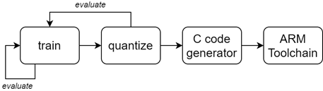
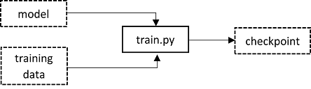

# MAX78000 Workflow Guide

## Introduction

This application note is intended to serve as a quick start guide that demonstrates the use of the Analog Devices MAX78000/MAX78002 AI toolchain. All information contained here appears in greater detail in the analogdevicesinc github repository training and synthesis README.md&#39;s at [https://github.com/analogdevicesinc/ai8x-training](https://github.com//analogdevicesinc/ai8x-training)

The documentation within the GitHub repositories should be considered authoritative, but this guide demonstrates a quick path from model to C code for the AI initiate.

The process of developing AI applications for the MAX78000 begins with a dataset and a model. The training repository at [https://github.com/analogdevicesinc/ai8x-training](https://github.com/analogdevicesinc/ai8x-training) contains many examples based on public datasets.

With a dataset and model in-hand, training, network quantization, and evaluation occurs in an iterative fashion until satisfactory results are achieved. Then the quantized network and MAX78000-specific model are used to generate C code that loads the network weights and structure into the MAX78000 and executes inferences.




What follows are the basic steps in the MAX78000 workflow. For details, please refer to the README.md&#39;s as well as the bash and python scripts contained within the training and synthesis repositories.

## Training

Training is the process of generating a PyTorch checkpoint file given a model and set of training data. PyTorch models reside in the _models_ directory and corresponding torchvision datasets.



Before working in the training directory, be sure to run _deactivate_ followed by _source bin/activate_ in order to configure the python environment for training. The _activate_ and _deactivate_ commands control the python environment used for the training and synthesis.

From the root of the training directory ([https://github.com/analogdevicesinc/ai8x-training](https://github.com/analogdevicesinc/ai8x-training)), execute scripts/train\_mnist.sh. This script invokes train.py with a set of configuration parameters including a model and mnist dataset.

train\_mnist.sh:

```console
./train.py --epochs 200 --deterministic --compress schedule.yaml --model ai85net5 --dataset MNIST --confusion --param-hist --pr-curves --embedding --device MAX78000 "$@"
```

The --model parameter specifies the Pytorch model to use. Supported models are implemented in python scripts in the _models_ directory. Each script exports a variable called _models_ which relates the value specified in the --model parameter to a Pytorch model implementation.

The --dataset parameter specifies the torchvision dataset to use. Dataset loader scripts are in the _datasets_ directory and export a variable called _datasets_ which relates the value specified in the --dataset parameter to a torchvision dataset. Datasets are downloaded into the _data_ subdirectory.

The output of training is a checkpoint file called best.pth.tar. You&#39;ll find this file in the _logs_ directory tree. Each time train.py is invoked and new subdirectory under logs is created according to the current time and date, for example, 2021.03.10-122323. Additionally, two softlinks are created identify the most recent training directory and log file, _latest\_log\_dir_ and _latest\_log\_file_ respectively.

## Quantization

Quantization is the process of converting floating point weights from a checkpoint file into fixed-point weights compatible with the MAX780000&#39;s hardware CNN. Quantization is performed in synthesis directory ([https://github.com/analogdevicesinc/ai8x-synthesis](https://github.com/analogdevicesinc/ai8x-synthesis)).

Before working in the synthesis directory, be sure to run _deactivate_ followed by _source bin/activate_ in order to configure the python environment for synthesis.

Continuing with our mnist example, copy the _best.pth.tar_ file from the logs/\&lt;time/date\&gt; directory into the trained directory and rename it to _ai85-mnist-qat8.pth.tar_ (you may need to first delete the pre-existing file of this name). This will allow you to use the existing mnist quantize script, _scripts/quantize\_mnist.sh_ located in the _scripts_ directory.

quantize\_mnist.sh:

```console
./quantize.py trained/ai85-mnist-qat8.pth.tar trained/ai85-mnist-qat8-q.pth.tar --device MAX78000 -v "$@"
```

The output of quantization is _trained/ai85-mnist-qat8-q.pth.tar_. This file can be used to evaluate synthesis using scripts/evaluate\_mnist.sh in the training directory or can be provided to the network loader, ai8xize.py, to generate C code for the MAX78000.

## Evaluation

Evaluation of a trained model routinely occurs in two places in the workflow, post-training and post-quantization. Evaluation uses test data, that is data not used during training, to measure the performance of the network. Post-training evaluation occurs often throughout development. Post-quantization evaluation occurs later in development and is used to measure the impact of quantized weights on network performance.

Once the weights have been synthesized (and optionally quantized), the results can be tested with the--evaluate option provided by train.py. You can find examples of this option in the _scripts_ directory. Here&#39;s the contents of evaluate\_mnist.sh:

```console
./train.py --model ai85net5 --dataset MNIST --confusion --evaluate --exp-load-weights-from ../ai8x-synthesis/trained/ai85-mnist-qat8-q.pth.tar -8 --device MAX78000 "$@"
```

train.py is provided the quantized weights from the output of the quantize.py script.

## C code auto generator (network loader)

The next step in the workflow is to generate C code from the quantized weights. This is done with the help of the Network Loader, ai8xize.py and a yaml network description file that defines the model in the context of the MAX780000 CNN architecture. The yaml network description correlates directly with the Pytorch model used to generate the weights but adds MAX780000 CNN specific information. Network descriptions reside in the _networks_ subdirectory.

gen-demos-max78000.sh provides an example of invoking ai8xize.py with various network weights descriptions appropriate for each of the example demonstrations. Here&#39;s a command line that you can use to generate mnist source:

```console
./ai8xize.py --verbose --log --test-dir sdk/Examples/MAX78000/CNN --prefix mnist --checkpoint-file trained/ai85-mnist-qat8-q.pth.tar --config-file networks/mnist-chw-ai85.yaml --softmax --device MAX78000 --compact-data --mexpress --timer 0 --display-checkpoint
```

--test-dir specifies where the C project will be created. _sdk/Examples/MAX78000/CNN_ conveniently locates this directory within the MSDK so that you can simply run _make_ to generate a firmware image as with all the MSDK projects.

By default, ai8xize.py targets the MAX78000 evkit. If you are working with a different target, use the --board-name option to specify that target. For example, if your target is the MAX78000FTHR, add:

--board-name FTHR\_RevA

At this point, you can build, flash, and debug as you would any MSDK firmware project.

The loader generates code that performs a known-answer test which does not rely on sourcing real input data from sensors.
