# MAX7800x Power Monitor and Energy Benchmarking Guide

## Introduction

This document describes the integrated power measurement circuit on the [MAX78000EVKIT](https://www.maximintegrated.com/en/products/microcontrollers/MAX78000EVKIT.html)  and [MAX78002EVKIT](https://www.maximintegrated.com/en/products/microcontrollers/MAX78002EVKIT.html), and how to instrument firmware to facilitate power, time and energy measurements when loading kernels and input data, and performing CNN inferences.

The power monitor circuit and firmware are provided as a convenient means of comparing performance improvements during model and firmware development.  While the measurement accuracy and precision are sufficient for this purpose, the power monitor system is not a replacement for bench measurement equipment.

## System Design

The Power Monitor (PMON) consists of an MCU (MAX32625), a power measurement AFE, sense resistors, an LCD, and a dedicated USB port. The AFE measures the voltage and current at 1024Hz of four supplies that power the MAX78000 and MAX78002. The PMON firmware collects measurement data and displays it on the small LCD.

### MAX7800EVKIT

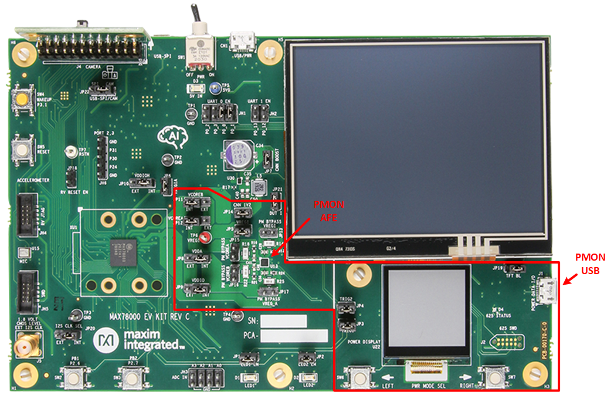

On the MAX78000EVKIT, JP3 and JP4 connect TRIG1 and TRIG2 signals from the MAX78000 to the PMON MCU to enable windowed power measurements.


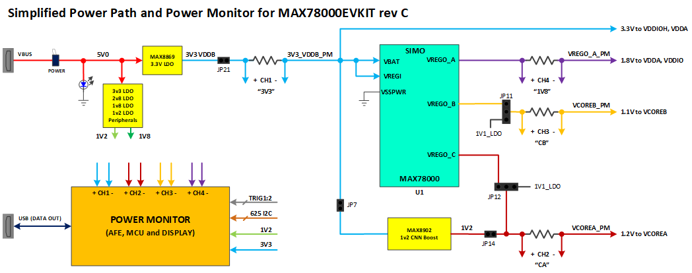


### MAX78002EVKIT

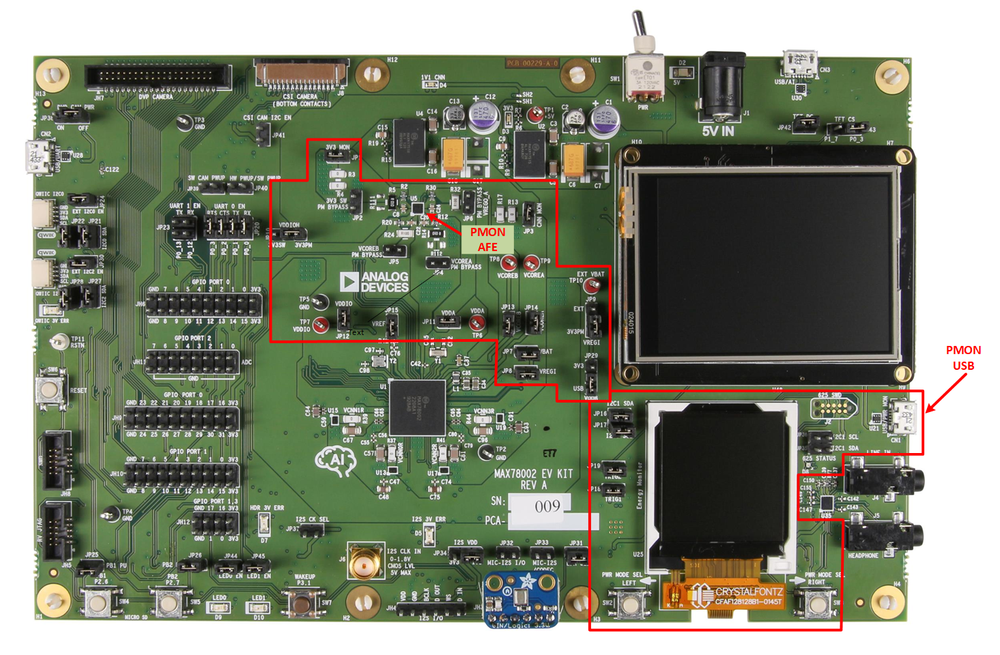
On the MAX78002EVKIT, JP18 and JP19 connect TRIG1 and TRIG2 signals from the MAX78002 to the PMON MCU to enable windowed power measurements.


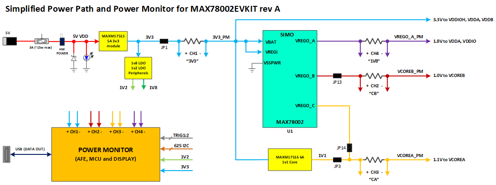


## Board Setup

### Verify and Update the Power Monitor Firmware

It is highly recommended to check the PMON firmware version to ensure your board has the latest firmware loaded on the EVKIT.  This document describes PMON version 2.0 and higher.  To determine the PMON version, power on the board and view the small LCD display.

If you see power information in the display, then the PMON is functioning, and you can proceed to the next section. However if no information appears on the display, you will need to check if the PMON MCU has a boot loader. To do this, press the PWR MODE SEL LEFT pushbutton (SW6 on MAX78000EVKIT, or SW2 on MAX78002EVKIT) while power cycling the board. This will put the PMON MCU into boot loader mode. If the 625 STATUS LED (D4 on MAX78000EVKIT, or D8 on MAX78002EVKIT) illuminates, then the boot loader is available. If the boot loader is not available, then you will need to exchange your board for one that has the boot loader installed.

#### Updating the Power Monitor Firmware

The PMON firmware version can be checked by repeatedly pressing either the PWR MODE SEL LEFT or RIGHT button to cycle through the screens to view the information page for either the MAX78000EVKIT or MAX78002EVKIT as shown here.  


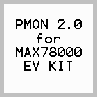 


Check the reported version against the latest PMON firmware binaries available on from

[MAX78000_Evaluation_Kit/PMON_Firmware](https://github.com/MaximIntegratedAI/MaximAI_Documentation/tree/master/MAX78000_Evaluation_Kit/PMON_Firmware)

[MAX78002/Evaluation_Kit/PMON_Firmware](https://github.com/MaximIntegratedAI/MaximAI_Documentation/tree/master/MAX78002_Evaluation_Kit/PMON_Firmware)


To load a PMON firmware image, connect the dedicated PMON USB port (J1 on MAX78000EVIT, or CN1 on MAX78002EVKIT) to your PC and put the PMON MCU into boot loader mode by pressing the PWR MODE SEL LEFT pushbutton (SW6 on MAX78000EVKIT and SW2 on MAX78002EVKIT) while power cycling the board.  Wait for 625 STATUS LED (D4 on MAX78000EVKIT, or D8 on MAX78002EVKIT) to illuminate. A virtual drive will appear on your host PC. Drag and drop the PMON firmware image onto the drive. Once the drive disappears, you may need to power cycle the board. The PMON firmware should display power information a second or two after reset.

### Verify Jumper Installation

#### MAX78000EVKIT

JP3 and JP4 must be installed for windowed power accumulation mode to work.

All “bypass” shunts must be removed: JP2, JP4, JP5, and JP6.

JP10 and JP8 must be set to the “INT” position. JP9 may be set to either position depending if the currents for GPIO pins on VDDIO are desired to be included in the 1V8 measurements. Set to “INT” to include these currents. Usually, these currents are not desired to be included since they are board specific. In this case set, JP9 to “EXT”.

Select the desired position for JP11 and JP12 to source VCOREA and VCOREB from the MAX78000 SIMO converter or from the on board LDOs.  Using the on board LDOs removes these load currents from the 3V3 measurements.

#### MAX78002EVKIT

JP18 and JP19 must be installed for windowed power accumulation mode to work.

All “bypass” shunts must be removed: JP17, JP13, JP16, and JP15.

JP1, JP3, JP7, JP8, JP11 - JP14 must be installed.  JP9 must be set to the 3V3PM position.

JP10 may be set to either position depending on if the VDDIOH GPIO pin currents are desired to be included in the 3V3 power measurement. Set to 3V3PM to include these currents. Usually, these currents are not desired to be included since they are board specific. In this case set, JP10 to 3V3SW.

JP29 may be set to either position depending if the MAX78002 USB XCVR pin currents are desired to be included in the power measurement.  Set to 3V3 to include this current. Usually, these currents are not desired to be included. In this case set, JP29 to USB.


## Using the Power Monitor

On power-up, the PMON LCD will briefly display the Analog Devices logo then show the Average Power measurement mode described in the next section.  Pushbuttons located just below the PMON LCD and labled PWR MODE SEL LEFT and PWR MODE SEL RIGHT (SW6 and SW7 on MAX78000EVKIT, or SW2 and SW3 on MAX78002EVKIT) allow navigation between the following PMON modes:

- Average Power Mode
- Supply Current Mode
- Supply Voltage Mode
- CNN Power Mode (Windowed Energy Accumulation mode with timing trigger signals required)
- System Power Mode  (Windowed Energy Accumulation mode with timing trigger signals required)


#### Supply Measurement Mapping

The following tables describe the LCD labels, board net, MAX7800x supply input pins and a description of the load being measured.

#### MAX78000EVKIT

| LCD Label | Board Net   | MAX78000 Pins | Vnom | Description                      |
| --------- | ----------- | ------------- | ---- | -------------------------------- |
| 3V3       | 3V3_VDDB_PM | VREGI, VDDIOH | 3.3V | Total MAX78000 load              |
| CA        | VCOREA_PM   | VCOREA        | 1.2V | CNN, MCU, digital & memory loads |
| CB        | VCOREB_PM   | VCOREB        | 1.0V | Low power memory mode loads      |
| 1V8       | VREGO_A_PM  | VDDIO, VDDA   | 1.8V | GPIO and Analog block loads      |

#### MAX78002EVKIT

| LCD Label | Board Net  | MAX78002 Pins | Vnom | Description                      |
| --------- | ---------- | ------------- | ---- | -------------------------------- |
| 3V3       | 3V3_PM     | VREGI, VDDIOH | 3.3V | Total MAX78002 load              |
| CA        | VCOREA_PM  | VCOREA, VCNNx | 1.1V | CNN, MCU, digital & memory loads |
| CB        | VCOREB_PM  | VCOREB        | 1.0V | Low power memory mode loads      |
| 1V8       | VREGO_A_PM | VDDIO, VDDA   | 1.8V | GPIO and Analog block loads      |


### Average Power Measurement Mode

The AVG PWR mode displays the measured power being consumed from each power rail in milliwatts and is useful for quickly making coarse power measurements.  The 3V3 power measurement includes the power being consumed by the other MAX78000/MAX78002 supply rails plus voltage converter losses.


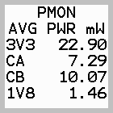

### Supply Voltage Mode

The SUPPLY V mode displays the voltage measurement of each rail in volts. The measurement is performed at the negative end of the current sense resistor (negative input of each PMON AFE channel).


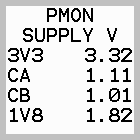

### Supply Current Mode

The CURRENT mode displays the current measured on each rail by the PMON AFE in milliamps.


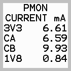

### Windowed Energy Accumulation

The intent of Windowed Energy Accumulation is to infer activity-specific power consumption by measuring total power dissipation on VCOREA. The question this mode seeks to answer is: *“How much energy is the model using per inference and/or per operation?”*.

The power measurements provided by this mode are as follows:

**E**  = Energy transformed during the window

**T**  = Active measurement period

**I**  = Idle period power measurement

**A**  = Active period power measurement

*Windowed Energy Accumulation* requires timing signals from the MAX7800x firmware that define measurement periods for idle and active during both the CNN Power Mode and the System Power Mode.


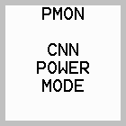 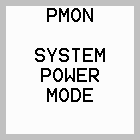


#### Instrumenting MAX7800x Firmware

To use the Windowed Energy Accumulation Mode, the application firmware running on the MAX78000 or MAX78002 must be instrumented with provided function calls that communicate the idle energy and active energy measurement windows to the PMON MCU via GPIO signals that originate from the MAX78000 or MAX78002.

- The `SYS_START`/`SYS_COMPLETE` macros can be used to define the idle energy period signaled by TRIG1. This is needed for both CNN Accelerator Power measurement and Total System Power measurement.
- The `CNN_START`/`CNN_COMPLETE` macros can be used to define the active energy period signaled by TRIG2. This is used only for CNN Accelerator Power measurement.
- Instrumentation code and macros are automatically inserted when adding the `--energy` option to *ai8xize.py*.

Before instrumenting firmware, it is helpful to understand the limitations of the PMON’s AFE. The AFE accumulates power data at 1024Hz. Additionally, there is about 1ms of latency in the PMON MCU to read from the AFE. These facts constrain the minimum measurement period. The suggested window period is 100ms to 20 seconds.  Since normal operations are typically shorter, operations are repeated to satisfy the minimum measurement window.

Please note the following:

- Routing TRIG1 and TRIG2 to the PMON MCU requires that jumpers JP3 and JP4 be be installed on the MAX78000EVKIT and JP18 and JP19 be installed on the MAX78002EVKIT.

- On the MAX78000EVKIT, the energy accumulation mode signals TRIG1 and TRIG2 are shared with LED1 and LED2 so it is important to remove all existing calls to `LED_On()` and `LED_Off()`.
- On the MAX78002EVKIT, the energy accumulation mode signals TRIG1 and TRIG2 are shared with parallel camera interface pins PCIFD10 and PCIFD11.  The instrumented firmware may not be compatible with a 12-bit parallel bus camera installed.


------

**Recommendation:** Disconnect all connections to the EVKit that are not essential for power measurement.  This includes removing the SWD cable after the loading the instrumented firmware.

------


#### CNN Accelerator Power Measurement

The application firmware specifies two power accumulation windows, the idle power window (I), and the active power (A) window which by itself includes 3 stages. These windows are defined by the assertion of two non-overlapping GPIO signals TRIG1 and TRIG2 by the MAX78000 or MAX78002. The code to drive these GPIO signals can be generated by the *ai85izer* tool included in the MAX78000 or MAX78002 SDK or the signals can be driven by user code using the existing macros. See the section *Instrumenting MAX7800x Firmware* above.

The Power Monitor firmware will measure idle power (I), active power (A), and the time period of the active power measurement (T). Resulting energy dissipated (E) is calculated as follows:

$$ E = (A-I)*T $$

Windowed energy accumulation mode begins displaying “CNN Power Mode”. Once the idle measurement period signal is asserted, the display will transition to “MEASURING IDLE POWER”. The idle measurement period is nominally 1 second.

The idle measurement signal is then deasserted and the active measurement signal is asserted. Active power is measured in 3 stages. **To make sure that enough energy is accumulated and averaged in each stage, the operation in each stage is repeated 100 times.** The power monitor will internally divide the measured accumulated energy by 100.

Active power measurements:

- Loading Kernel Power: 100× loading CNN accelerator weights

- Loading Input Power: 100× loading input data

- Loading Input and Inference Power: 100× loading input data and running inference

  

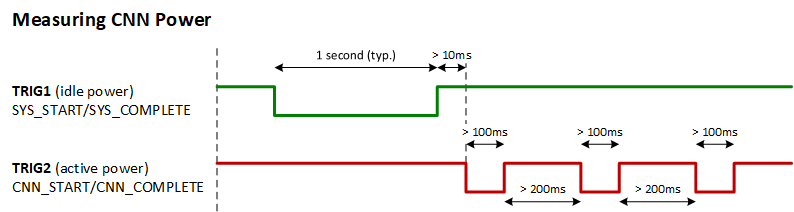

It is important to ensure the timing and sequence of the energy accumulation mode signals as described in the figure above.

The PMON samples voltage and current associated with VCORE_A. This is the rail used by the CNN accelerator and other logic. If the intent is to isolate CNN accelerator power consumption, it is necessary to subtract non-CNN accelerator power consumption. This can be accomplished by first measuring an idle period power where the CNN accelerator is not active and subtracting that value from three stages of CNN-active power measurement period.

##### Firmware Example

The code below uses the `SYS_START`/`SYS_COMPLETE` macros to assert the idle power measurement signal. Similarly, the `CNN_START`/`CNN_COMPLETE` macros can be used to assert the active power measurement signals. The code snippet below provides a simplified example of the instrumentation methodology used when the power monitor is in CNN Accelerator Power Mode looking for the window trigger signals.

*These calls are automatically inserted when adding the `--energy` option to ai8xize.py.*

```C
  printf("Measuring system base power...\n");
  SYS_START;
  MXC_Delay(SEC(1));
  SYS_COMPLETE;

  printf("Measuring weight loading...\n");
  CNN_START;
  for (i = 0; i < 100; i++)
    cnn_load_weights(); // Load kernels
  CNN_COMPLETE;

  printf("Measuring input loading...\n");
  MXC_TMR_Delay(MXC_TMR0, 500000);
  CNN_START;
  for (i = 0; i < 100; i++)
    load_input(); // Load data input
  CNN_COMPLETE;

  printf("Measuring input load + inference...\n");
  MXC_TMR_Delay(MXC_TMR0, 500000);
  CNN_START; // Allow capture of processing time
  for (i = 0; i < 100; i++) {
    load_input(); // Load data input
    cnn_start(); // Run inference
    while (cnn_time == 0)
      __WFI(); // Wait for CNN
  }
  CNN_COMPLETE;
```

The result includes the active power of loading only weights (kernels), loading only input data, and loading data and running inference. The results are displayed on three screens, selectable by the PWM MODE SEL RIGHT pushbutton (SW7 on MAX78000EVKIT or SW3 on MAX78002EVKIT):


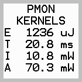 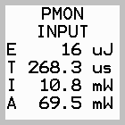 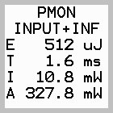

In order to measure only the energy (or time) of the inference, the user can subtract the energy (or time) for loading input data from the energy (or time) for loading input data + inference, *if FIFO mode is <u>not</u> used*.

In FIFO mode, the inference does not wait for the entire input data to be loaded and starts as soon as enough data is in the FIFO. Therefore, it is not possible to separate and subtract the energy or time needed for data loading.

#### System Power Measurement

In this mode, the total system energy is measured, which includes the CNN accelerator. The measurement starts from assertion of `SYS_START` and ends at assertion of `SYS_COMPLETE`. This mode can be used to measure the total energy consumption of an application. TRIG2 is kept high throughout this measurement. This mode is similar to the idle power measurement described above. The measurement duration should be between 100ms to 20 seconds.


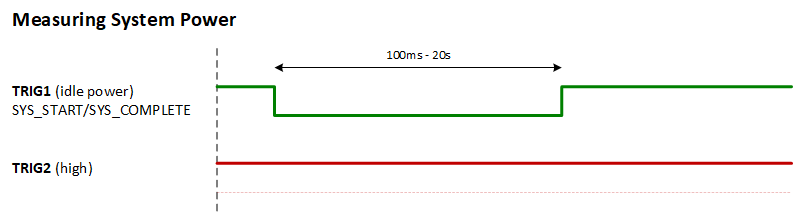

##### Firmware Example

The code below uses the SYS_START/SYS_COMPLETE macros to assert the system power measurement signals. Make sure the power monitor is in System Power Mode.

```C
 printf("Measuring system power...\n");
 SYS_START;
 call_functionA();
 call_functionB();
 SYS_COMPLETE;
```

The user can alternatively also set up a timer to assert the signals periodically and measure the system power in application run-time. The result will be displayed at the end.


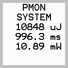


## Streaming Measurement Data to the Serial Port

In all modes, measured data is displayed on the screen and streamed via the PMON USB virtual serial port to a serial terminal application (minicom, gtkterm, etc.).  The measurement mode can be selected with the LEFT or RIGHT pushbuttons, or the via the terminal program interface where the following single-key commands are accepted:

- v  - voltage mode
- i   - current mode
- w - power mode
- t  - triggered mode (used with the *ai8xize.py* `--energy` option)

The output stream is a comma-delimited, full-precision format of the measurement data presented on the LCD, and can be captured to a file using the logging feature of the serial terminal application.

