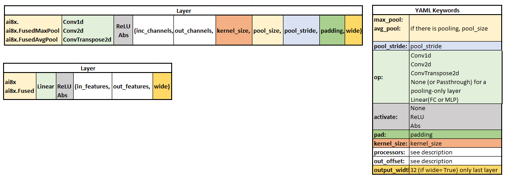

# Network Description YAML Files: A Quick Start Guide

*3/15/2021*

This document is intended to help users to create network description YAML files corresponding to their network models.


## Purpose of Network Description YAML files

It is a network description written in YAML, a simple markup language. Typically, the outcome of training a model is a checkpoint (PyTorch). Checkpoint files only include the weights, but not the network operators and layer sequence, and there is no scheduling of hardware resources. However, all of these are needed for the synthesis tool in order to program the MAX78000. The purpose of the YAML file is to describe the model in a hardware-centric fashion. *The YAML file can also be viewed as a “sidecar” file to the checkpoint file.*

## Information needed to create YAML files

1. The model that is used for training.
2. Some basic knowledge about MAX78000 hardware.

Following the instructions below, you will be able to create a layer-by-layer description of your model in the YAML format. Once completed, copy the YAML file to ai8x-synthesis/networks and reference it in the synthesis script for your trained model.

 

## YAML File Structure

The YAML file includes global configuration in the header, followed by a layer-by-lauerdescription which correspond to the layers in the model.

### 1. Global Configuration Section

Using the “`arch`“ and “`dataset`“ keywords, the global section must include the name of the model and dataset as used for training. These keywords are used to make sure a YAML file matches a trained model, and to pull in a sample data file for the known-answer test (KAT) that is auto-generated by the synthesis tool.

Example: MNIST

*./train.py --epochs 200 --deterministic --compress schedule.yaml --model **ai85net5** --dataset **MNIST** --confusion --param-hist --pr-curves --embedding --device MAX78000*

```yaml
# ------------   Global Configuration   ------------
arch: ai85net5  # Mandatory: use the name of the model as in training
dataset: MNIST  # Mandatory: use the name of the dataset as in training 
```


### **2. Layer Description Section**

The layer descriptions section defines each layer as it appears in the model. This section starts with the “`layers`“ keyword, followed by the configuration of each layer.  

Use “`-`” as the delimiter to start each layer. The order of keywords in the description of a layer is arbitrary. 

```yaml
# ------------   Layers   ------------
- pad: 0
  activate: ReLU
  out_offset: 0x2000
  processors: 0xffffffffffffffff
  data_format: HWC
  operation: Conv1d
  kernel_size: 1
```


The following figure shows how a layer in the model is mapped to YAML:




The table below shows the description of frequently used keywords. For a complete list of keywords and more description, please check the main documentation [README.md](https://raw.githubusercontent.com/MaximIntegratedAI/MaximAI_Documentation/develop/README.md).

| keyword      | Description                                                  | Available options                                            |
| ------------ | ------------------------------------------------------------ | ------------------------------------------------------------ |
| data_format  | **ONLY in first layer**, specifies the organization of data in memory. The optimum choice depends on the data source (interleaved channels/HWC or channels in sequence/CHW). When there is no particular preference, HWC is recommended for input data of less than 90×91 per channel. | CHW or HWC                                                   |
| op           | The layer operation as in the model                          | Conv1d, Conv2d, ConvTranspose2d, None (or Passthrough), Linear (or FC or MLP), Add, Sub, Xor, Or |
| pad          | The padding of the layer in the model                        | For Conv2d , this value can be 0 , 1 (the default), or 2 .<br/>For Conv1d , the value can be 0 , 1 , 2 , or 3 (the default).<br/>For Passthrough , this value must be 0 (the default). |
| activate     | The layer activation                                         | ReLU , Abs or None (the default).                            |
| max_pool     | The pool_size if the layer includes MaxPool                  | 1 to 16                                                      |
| avg_pool     | The pool_size if the layer includes AvgPool                  | 1 to 16                                                      |
| pool_stride  | The pool_stride if the layer includes MaxPool or AvgPool     | 1 to 16                                                      |
| kernel_size  | The kernel size                                              | For conv2d: 1 (1×1) or 3 (3×3) (default)<br/>For conv1d: 1 (default) to 9 |
| processors   | Each bit of this 64-bit processor map represents enabling of one of the 64 processors in CNN.  The number of enabled processors should match the input channel count. When using more than 64 channels, the number of processors is an integer division of the channel count, rounded up. For example, 60 processors (0x0fffffffffffffff) are specified for 120 channels.<br/>**Note 1:** If possible, try to use processors with non-overlapping memory instances (*4 processors share the same memory instance*) in consecutive layers (e.g. processors: 0x0000000000000001 in layer 1 and 0x00000000000ffff0 in layer 2)<br/>**Note 2:** if CHW data_format is used, processors must be attached to different memory instances (e.g. for <u>3 input channels: 0x0000000000000111 in CHW, 0x0000000000000007 in HWC)<br/>**Note 3:**  For optimum efficiency, it is recommended to choose the number of channels as a multiple of 4 in each layer<br/>**Note 4:**  In linear layers, the number of processors is the number of channels before flattening. | 0x0000000000000001  to 0xffffffffffffffff                    |
| out_offset   | The relative offset inside the data memory to write the output data to.<br/>**Note 5:**  The input of each layer is taken from the output offset of the previous layer. To avoid overwriting an input that has not been consumed, use ping-ponging between out_offset=0 and half the memory (0x4000)  or less in consecutive layers. | 0x0000 to 0x8000                                             |
| flatten      | Used in Linear layers to specify that 2D input data should be transformed to 1D data | True, False (default)                                        |
| output_width | Specifies the output number of bits. It is used **only in the last layer** if there is no activation to specify 32-bit output of unclipped data in Q17.14 format. <br/>**Note 6:**  To use `output_width: 32`, the last layer in the model must be trained with *wide=True* | 8 (default),  32                                             |
| in_dim       | Specifies the dimensions of the input data. Automatically computed in most cases, **but must be specified when changing from 1D to 2D data or vice versa** | [x, y]                                                       |


## Examples

**Example 1: MNIST** 

See the model equivalent of each layer:

```yaml
arch: ai85net5
dataset: MNIST

# Define layer parameters in order of the layer sequence
layers:
# +++++++++++++++++++++ layer 0:   input 28x28x1:  ai8x.FusedConv2dReLU(3, 60, 3, padding=1)
- pad: 1
  activate: ReLU
  out_offset: 0x4000
  processors: 0x0000000000000001   # input channels: 1, start from first processor
  data_format: CHW
  op: conv2d
  kernel_size: 3x3
  
# +++++++++++++++++++++ layer 1: ai8x.FusedMaxPoolConv2dReLU(60, planes, 3, pool_size=2, pool_stride=2, padding=2)
- max_pool: 2
  pool_stride: 2
  pad: 2
  activate: ReLU
  out_offset: 0
  processors: 0xfffffffffffffff0  # input channels: 60, start from 5th processor in 2nd memory instance
  op: conv2d
  kernel_size: 3x3

# +++++++++++++++++++++ layer 2: ai8x.FusedMaxPoolConv2dReLU(60, 54, 3, pool_size=2, pool_stride=2, padding=1)
- max_pool: 2
  pool_stride: 2
  pad: 1
  activate: ReLU
  out_offset: 0x4000
  processors: 0xfffffffffffffff0 # input channels: 60
  op: conv2d
  kernel_size: 3x3

# +++++++++++++++++++++ layer 3: ai8x.FusedAvgPoolConv2dReLU(54, 12, 3, pool_size=2, pool_stride=2, padding=1)
- avg_pool: 2
  pool_stride: 2
  pad: 1
  activate: ReLU
  out_offset: 0
  processors: 0x0ffffffffffffff0 # input channels: 54
  op: conv2d
  kernel_size: 3x3
  
# +++++++++++++++++++++ layer 4:   ai8x.Linear(12*28*28, 10, bias=True, wide=True)
- op: mlp
  flatten: true
  out_offset: 0x1000
  output_width: 32  # model is trained with wide = True, we can get 32 bit output
  processors: 0x0000000000000fff # input channels before flatenning: 12
```


**Example 2:** KWS20_v1

```yaml
arch: ai85kws20net
dataset: KWS_20

# Define layer parameters in order of the layer sequence
layers:
# +++++++++++++++++++++ layer 0:   input 128x128:  ai8x.FusedConv1dReLU(128, 100, 1, stride=1, padding=0)
- pad: 0
  activate: ReLU
  out_offset: 0x2000
  processors: 0xffffffffffffffff # input channels: 128, use all processors
  data_format: HWC
  operation: Conv1d
  kernel_size: 1
  
# +++++++++++++++++++++ layer 1:  ai8x.FusedConv1dReLU(100, 100, 1, stride=1, padding=0)
- pad: 0
  activate: ReLU
  out_offset: 0x0000
  processors: 0x000fffffffffffff
  operation: Conv1d
  kernel_size: 1
  
# +++++++++++++++++++++ layer 2:   ai8x.FusedConv1dReLU(100, 50, 1, stride=1, padding=0) 
- pad: 0
  activate: ReLU
  out_offset: 0x2000
  processors: 0x000fffffffffffff
  operation: Conv1d
  kernel_size: 1
  
# +++++++++++++++++++++ layer 3:   ai8x.FusedConv1dReLU(50, 16, 1, stride=1, padding=0) 
- pad: 0
  activate: ReLU
  out_offset: 0x0000
  processors: 0x0003ffffffffffff
  operation: Conv1d
  kernel_size: 1
  
# +++++++++++++++++++++ layer 4:   ai8x.FusedConv2dReLU(16, 32, 3, stride=1, padding=1) 
# Conv 2D - 5 layers
- pad: 1
  in_dim: [16, 8]      # needed as moved from 1D to 2D
  activate: ReLU
  out_offset: 0x2000
  processors: 0x000000000000ffff
  operation: Conv2d
  kernel_size: 3x3    # default: optional
  
# +++++++++++++++++++++ layer 5:   ai8x.FusedConv2dReLU(32, 64, 3, stride=1, padding=1)
- pad: 1
  activate: ReLU
  out_offset: 0x0000
  processors: 0x0000ffffffff0000
  operation: Conv2d

# +++++++++++++++++++++ layer 6:   ai8x.FusedConv2dReLU(64, 64, 3, stride=1, padding=1)
- pad: 1
  activate: ReLU
  out_offset: 0x2000
  processors: 0xffffffffffffffff
  operation: Conv2d

# +++++++++++++++++++++ layer 7:   ai8x.FusedConv2dReLU(64, 30, 3, stride=1, padding=1)
- pad: 1
  activate: ReLU
  out_offset: 0x0000
  processors: 0xffffffffffffffff
  operation: Conv2d

# +++++++++++++++++++++ layer 8:   ai8x.FusedConv2dReLU(30, 7, 3, stride=1, padding=1)
- pad: 1
  activate: ReLU
  out_offset: 0x0000
  processors: 0xfffffffc00000000
  operation: Conv2d
  
# +++++++++++++++++++++ layer 9:   ai8x.Linear(7 * 128, 21, wide=True)
- flatten: true
  out_offset: 0x2000
  processors: 0x000000000000007f # input channels before flattening: 7
  operation: MLP
  output_width: 32

```


## Common Pitfalls and Errors

The following table summarizes some  common problems that cause synthesis errors.

|      | Synthesis Error                                              | Example                                                      | Resolution                                                   |
| ---- | :----------------------------------------------------------- | ------------------------------------------------------------ | ------------------------------------------------------------ |
| 1    | ERROR: Layer 0 uses CHW input format, but multiple channels share the same memory instance. Modify the processor map for layer 0. | - pad: 1<br/>  activate: ReLU<br/>  out_offset: 0x0000<br/>  processors: 0x0000000000000007 <br/>  data_format: CHW<br/>  operation: Conv2d | change processor map to 0x0000000000000111 or use HWC data_format |
| 2    | ERROR: Layer 2 has 50 outputs with output expansion 1, threshold 50, but processor output map 0x0007ffffffffffff has 51 bits instead of the expected number of 50. | - pad: 0<br/>  activate: ReLU<br/>  out_offset: 0x0000<br/>  processors: 0x0007ffffffffffff #0x0003ffffffffffff<br/>  operation: Conv1d<br/>  kernel_size: 1 | change processor map to 0x0003ffffffffffff                   |
| 3    | ERROR: Processor 0: Layer 9 output for CHW=0,0,0 is overwriting input at offset 0x00400000 that was created by layer 8, CHW=0,0,0. | - pad: 1<br/>  activate: ReLU<br/>  out_offset: 0x0000<br/>  processors: 0xfffffffc00000000<br/>  operation: Conv2d<br/>- flatten: true<br/>  out_offset: 0x0000<br/>  processors: 0x000000000000007f<br/>  operation: MLP<br/>  output_width: 32 | The out_offsets of back to back layers should “ping-pong”,  change the last out_offset to 0x4000 |
| 4    | ERROR: Input dimensions do not match in layer 0. Expected: 7x6, got 9x6. | sample data shape was 9×7                                    | Make sure C,W,H of sample data is correct (e.g. 7×9)         |
| 5    | assert operands == data.shape[0] // input_size[0]<br/>AssertionError | sample data shape was 1×9×7                                  | Make sure C,W,H of sample data is correct (e.g. 7×9)         |
