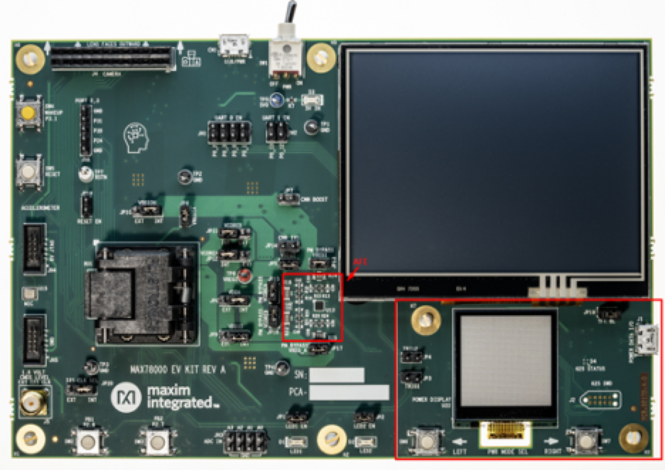
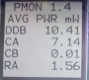
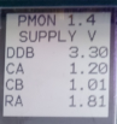
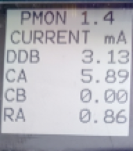
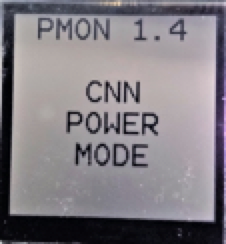
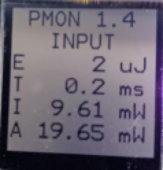
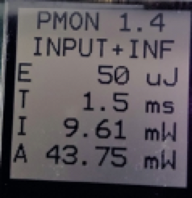
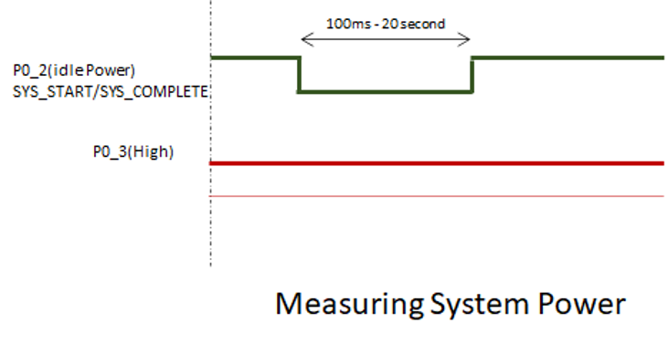
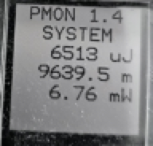

# MAX78000 Power Monitor and Energy Benchmarking Guide

## Introduction

This document describes how to instrument firmware to facilitate power measurement using the integrated power measurement circuit on the MAX78000EVKIT, [https://www.maximintegrated.com/en/products/microcontrollers/MAX78000EVKIT.html]

## System Design

The Power Monitor (PM) consists of an MCU, a power measurement AFE, an LCD, and a USB port separate from the MAX78000.



The AFE measures the voltage and current of four power sources used by the MAX78000 at 1024Hz. The PM firmware collects this data and displays it on the LCD. JP3 and JP4 connect signals from the MAX78000 to the PM MCU to enable windowed power measurements.

## Board Setup

### Verify and Update the Power Monitor Firmware

Not all boards have the current PM firmware loaded. To determine the state of your board, power on the board and see if the small LCD displays power information. If you see power information, then the PM is functioning, and you can proceed to the next section.

If no information is displayed, you will need to check and see if the PM MCU has a boot loader. To do this, press SW6 while power cycling the board. This will put the PM MCU into boot loader mode. If D4 illuminates, then the boot loader is available. If the boot loader is not available (very early board revisions), then you will need to exchange your board for one that has the boot loader installed.

#### Updating the Power Monitor Firmware

If the boot loader is available, please update to the latest PM firmware from [https://github.com/MaximIntegratedAI/MaximAI_Documentation/tree/master/MAX78000_Evaluation_Kit/PMON_Firmware].

To load a PM firmware image, connect the PM USB port to your and put the PM MCU into boot loader mode by pressing SW6 while power cycling the board (wait for D4 to illuminate). A virtual drive will appear on your host PC. Drag and drop the PM firmware image onto the drive. Once the drive disappears, you may need to power cycle the board. The PM firmware should display power information a second or two after reset.

### Verify Shunts

JP3 and JP4 must be installed for windowed power accumulation mode to work. All “bypass” shunts must be removed: JP17, JP13, JP16, and JP15.

JP10 and JP8 must be set to the “INT” position. JP9 may be set to either position depending on if you want to include pin currents in the power measurement. Set to “INT” to include these currents. Usually, you will not want to include these currents since they are board specific. In this case set, JP9 to “EXT”.

## Using the Power Monitor

On power-up, the PM will briefly display the Maxim Integrated logo and transition into instantaneous power measurement mode which is described in the next section.  SW6 and SW7 (located just below the PM LCD) allow navigation between various PM modes:

- Average Power Mode
- Supply Current Mode
- Supply Voltage Mode
- Windowed Energy Accumulation:
  - CNN Accelerator Power Mode (trigger required)
  - System Power Mode (trigger required)

### Average Power Measurement Mode

This mode displays the power being dissipated by each power source connected to the processor. The CNN accelerator is connected to VCORE_A which is labeled “CA” on the PM LCD.

| LCD Label | Board Net | MAX78000 | Notes                               |
| --------- | --------- | -------- | ----------------------------------- |
| DDB       | 3V3_VDDB  | VREGI    | 3.3V                                |
| CA        | VCOREA    | VCOREA   | 1.2V,  includes the CNN accelerator |
| CB        | VCOREB    | VCOREB   | 1.0V                                |
| RA        | VREGO_A   | VREGA    | 1.8V                                |

This mode is useful for quickly making coarse power measurements.



### Supply Voltage Mode

This mode displays the voltage being applied to each rail.



### Supply Current Mode

This mode displays the current being sourced to each rail.



### Windowed Energy Accumulation

The intent of Windowed Energy Accumulation is to infer activity-specific power consumption by measuring total power dissipation on VCOREA. The question this mode seeks to answer is: *“How much energy is the model using per inference and/or per operation?”*.

The power measurements provided by this mode are as follows:

**E**   Energy transformed during the window
**T**   Active measurement period
**I**    Idle period power measurement
**A**   Active period power measurement

*Windowed Energy Accumulation* requires triggering from firmware and can be used to measure either the CNN accelerator power, or the total System power:



#### Instrumenting MAX78000 Firmware

To use the Windowed Energy Accumulation Mode, the application firmware running on the MAX78000 must be instrumented with provided function calls that communicate the measurement window to the PM MCU via a GPIO signal.

Before instrumenting firmware, it is helpful to understand the limitations of the PM’s AFE. The AFE accumulates power data at 1024Hz. Additionally, there is a window latency of about 1ms (mostly PM firmware overhead). These facts constrain the minimum measurement period. The suggested window period is 100ms to 20 seconds

The monitor watches two GPIO signals originating from the MAX78000. The idle power measurement signal is delivered on GPIO P0_2 which is connects to the power monitor MCU via JP3. The active power measurement signal is delivered on GPIO P0_3 which connects via JP4. Both signals are active low.

On the MAX78000EVKIT, the energy accumulation mode signals are shared with LED1 and LED2 so it is important to remove all existing calls to `LED_On()` and `LED_Off()`.

- The `SYS_START`/`SYS_COMPLETE` macros can be used to define the idle energy period. This is needed for both CNN Accelerator Power measurement and Total System Power measurement.
- The `CNN_START`/`CNN_COMPLETE` macros can be used to define the active energy period. This is used only for CNN Accelerator Power measurement.

Instrumentation code and macros are automatically inserted when adding the `--energy` option to *ai8xize.py*.

#### CNN Accelerator Power Measurement

The application firmware specifies two power accumulation windows, the idle power window (I), and the active power (A) window which by itself includes 3 stages. These windows are defined by the assertion of two non-overlapping GPIO signals originating from the MAX78000. The code to drive these GPIO signals can be generated by the *ai85izer* tool included in the MAX78000 SDK or the signals can be driven by user code using the existing EVKIT LED calls. See the section *Instrumenting MAX78000 Firmware* below.

The Power Monitor firmware will measure idle power (I), active power (A), and the time period of the active power measurement (T). Resulting energy dissipated (E) is calculated as follows:

$$ E = (A-I)*T $$

Windowed energy accumulation mode begins displaying “CNN Power Mode”. Once the idle measurement period signal is asserted, the display will transition to “MEASURING IDLE POWER”. The idle measurement period is nominally 1 second.

The idle measurement signal is then deasserted and the active measurement signal is asserted. Active power is measured in 3 stages. **To make sure that enough energy is accumulated and averaged in each stage, the operation in each stage SHALL be repeated 100 times.** The power monitor will internally divide the measured accumulated energy by 100.

Active power measurements:

- Loading Kernel Power: 100× loading CNN accelerator weights
- Loading Input Power: 100× loading input data
- Loading Input and Inference Power: 100× loading input data and running inference


It is important to ensure the timing and sequence of the energy accumulation mode signals as described in the figure above.

The PM samples voltage and current associated with VCORE_A. This is the rail used by the CNN accelerator and other logic. If the intent is to isolate CNN accelerator power consumption, it is necessary to subtract non-CNN accelerator power consumption. This can be accomplished by first measuring an idle period power where the CNN accelerator is not active and subtracting that value from three stages of CNN-active power measurement period.

##### Firmware Example

The code below uses the `SYS_START`/`SYS_COMPLETE` macros to assert the idle power measurement signal. Similarly, the `CNN_START`/`CNN_COMPLETE` macros can be used to assert the active power measurement signals. Make sure the power monitor is in CNN Accelerator Power Mode.

*These calls are automatically inserted when adding the `--energy` option to ai8xize.py.*

```C
  printf("Measuring system base power...\n");
  SYS_START;
  MXC_Delay(SEC(1));
  SYS_COMPLETE;

  printf("Measuring weight loading...\n");
  CNN_START;
  for (i = 0; i < 100; i++)
    cnn_load_weights(); // Load kernels
  CNN_COMPLETE;

  printf("Measuring input loading...\n");
  MXC_TMR_Delay(MXC_TMR0, 500000);
  CNN_START;
  for (i = 0; i < 100; i++)
    load_input(); // Load data input
  CNN_COMPLETE;

  printf("Measuring input load + inference...\n");
  MXC_TMR_Delay(MXC_TMR0, 500000);
  CNN_START; // Allow capture of processing time
  for (i = 0; i < 100; i++) {
    load_input(); // Load data input
    cnn_start(); // Run inference
    while (cnn_time == 0)
      __WFI(); // Wait for CNN
  }
  CNN_COMPLETE;
```

The result includes the active power of loading only weights (kernels), loading only input data, and loading data and running inference. The results are displayed on three screens, selectable by the SW7 (Right Arrow) button:



In order to measure only the energy (or time) of the inference, the user can subtract the energy (or time) for loading input data from the energy (or time) for loading input data + inference, *if FIFO mode is <u>not</u> used*.

In FIFO mode, the inference does not wait for the entire input data to be loaded and starts as soon as enough data is in the FIFO. Therefore, it is not possible to separate and subtract the energy or time needed for data loading.

#### System Power Measurement

In this mode, the total system energy is measured, which includes the CNN accelerator. The measurement starts from assertion of `SYS_START` and ends at assertion of `SYS_COMPLETE`. This mode can be used to measure the total energy consumption of an application. P0_3 (LED2) needs to be kept high throughout this measurement. This mode is similar to the idle power measurement described above. The measurement duration should be between 100ms to 20 seconds.



##### Firmware Example

The code below uses the SYS_START/SYS_COMPLETE macros to assert the system power measurement signals. Make sure the power monitor is in System Power Mode.

```C
 printf("Measuring system power...\n");
 SYS_START;
 call_functionA();
 call_functionB();
 SYS_COMPLETE;
```

The user can alternatively also set up a timer to assert the signals periodically and measure the system power in application run-time. The result will be displayed at the end.



## Streaming Measurement Data to the Serial Port

In all modes, measured data is displayed on the screen and streamed via the USB serial port on J1. The interface accepts four single-key commands that mirror the functions indexable by the power monitor buttons:

- v  - voltage mode
- i   - current mode
- w - power mode
- t  - triggered mode (used with the *ai8xize.py* `--energy` option)

The output is a comma-delimited, full-precision format of the measurement data presented on the LCD.
