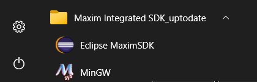

# Getting Started with the MAX78000 Evaluation Kit (EV Kit)

- [Getting Started with the MAX78000 Evaluation Kit (EV Kit)](#getting-started-with-the-max78000-evaluation-kit-ev-kit)
  - [List of Evaluation Kit Components](#list-of-evaluation-kit-components)
  - [Picture of EV Kit](#picture-of-ev-kit)
  - [Picture of Camera Module](#picture-of-camera-module)
  - [EV Kit Schematic](#ev-kit-schematic)
  - [Powering the MAX78000 Evaluation Kit for the First Time](#powering-the-max78000-evaluation-kit-for-the-first-time)
  - [Troubleshooting](#troubleshooting)
  - [Installing the Developer Tools (Linux)](#installing-the-developer-tools-linux)
  - [Installing the Developer Tools (Windows 10)](#installing-the-developer-tools-windows-10)
    - [Running Eclipse](#running-eclipse)
  - [Building the SDK Examples](#building-the-sdk-examples)
  - [Loading and Running Applications on the EV Kit](#loading-and-running-applications-on-the-ev-kit)
  - [Debugging Applications with GDB](#debugging-applications-with-gdb)
  - [How to Unlock a MAX78000 That Can No Longer Be Programmed](#how-to-unlock-a-max78000-that-can-no-longer-be-programmed)
  - [Additional SDK Information](#additional-sdk-information)
  - [Jumper Settings for the MAX78000 EV Kit](#jumper-settings-for-the-max78000-ev-kit)
  - [Proper installation of MAX78000 in the socket](#proper-installation-of-max78000-in-the-socket)
  - [Next Steps:  Loading and running the included **mnist** CNN example](#next-steps--loading-and-running-the-included-mnist-cnn-example)
    - [CNN Boost](#cnn-boost)
    - [Measuring CNN Current](#measuring-cnn-current)
    - [Links to mnist and additional CNN examples](#links-to-mnist-and-additional-cnn-examples)
  - [Going beyond the included CNN examples - Advanced Topics](#going-beyond-the-included-cnn-examples---advanced-topics)

## List of Evaluation Kit Components

Before beginning, you should make sure you have all of the following components of the evaluation kit.

- EV Kit Board with Socketed MAX78000
- MAX32625PICO Debugger with Cables
- Olimex ARM-USB-OCD-H
- Olimex ARM-JTAG 20-10 ADAPTER
- Camera Module + right angle header adapter
- 2 USB-A to MICRO-B Cables
- 1 USB-A to USB-B Cable
- Extra Shunts

## Picture of EV Kit


## Picture of Camera Module


For demos that need the camera to work in selfie mode(e.g. faceID), please use the provided right angle adapter to connect the camera to the evkit.

**Make sure to remove all protective film from the camera lens.**

## EV Kit Schematic

EV Kit schematic: [Schematics](https://www.maximintegrated.com/en/products/microcontrollers/MAX78000EVKIT.html)

## Powering the MAX78000 Evaluation Kit for the First Time

The MAX78000 Evaluation Kit (EV kit) comes preloaded with a MAX78000 device that has been preprogrammed with a sample application. This application blinks an LED and repeatedly outputs messages to its UART. Use this application to verify the hardware is connected and functioning properly.

1. Begin by making sure the PWR switch (SW1) is in the "OFF" position.

2. Make sure that jumper JP1 is installed.  This jumper enables LED, D1.  

3. Make sure that the P0_0 and P0_1 jumpers are installed on JH1.  These two jumpers connect UART0 RX and TX to the console output.

4. Connect USB cables from the PC to the USB/PWR connector (CN1) of the EV kit. This cable will power the board and provide a virtual serial port connection to the MAX78000's UART.

5. Install JP7 and JP14 to enable the external boost controller.

6. Move the PWR switch to the "ON" position.

7. On your PC, open a serial terminal application (minicom, gtkterm, etc.), and connect to the virtual serial port using a baud rate of 115200 and 8-N-1 settings.

8. Reset the EV kit via SW5.  You will see message from the MAX78000 appear in the terminal and LED1 (D1) on the board will begin blinking at a steady rate.

Once you see the described behavior, you know your board is functioning properly.


## Troubleshooting

If you do not get the expected results, here are some things to note.

- If the terminal program you are using says 'permission denied,' try prepending `sudo`.  For example, instead of typing 'gtkterm', type 'sudo gtkterm'.  Alternatively, ensure your user is part of the `dialout` group.
- If the serial port successfully opens, but nothing appears on the console output, press RESET on the EV Kit, SW5.
- Some early versions of the EV Kit did not pre-program the Hello World example, instead, they still have a test program in flash.  If you see a console output that starts with '***CNN Test*** ', you should also see '***PASS*** '.  In this case LED D1 should also be illuminated constantly.
- If you can no longer program the MAX78000, it may be in a locked-out state.  Refer to the "How to Unlock a MAX78000 That Can No Longer Be Programmed" section.
- If there are no signs-of-life (no LEDs blinking, no terminal output, no debugger communication), you can open the socket and inspect the MAX78000 to see if it is present and ball 1 is in the proper location.  Additional information regarding the socket and ball 1 indicators are provided below.  Be sure to power off the board before opening the socket.
- When UART0 RX (P0.0) is not connected (e.g., JH1-P0_0 open, or no external connection on CN1), both P0.0 and SWDCLK (P0.29) may be sensed as low during power up due to slow rise times. This is interpreted by the ROM as a boot loader entry request, and it interrupts the normal boot process. To ensure normal startup, place a 10kΩ pull-up resistor from P0.0 to 3.3V.

## Installing the Developer Tools (Linux)

There are a few tools you will need to build, load, run, and debug applications on the EV Kit.

- The GNU Tools for ARM Embedded Processors

    1. Browse to [developer.arm.com](https://developer.arm.com/tools-and-software/open-source-software/developer-tools/gnu-toolchain/gnu-rm/downloads) and download and extract the gcc-arm-none-eabi-9-2019-q4-major package that corresponds to your system.

    2. Edit your PATH variable to include the path to the arm-none-eabi directory.

- The MAX78000 SDK

    1. The SDK is hosted on GitHub and is a submodule of the ai8x-synthesis repository. To get the SDK and all the additional supporting files, clone the ai8x-synthesis repository (including submodules) found at <https://github.com/MaximIntegratedAI/ai8x-synthesis>.

- OpenOCD

    1. Analog Devices provides pre-built binaries. These should automatically be installed along with the ai8x-synthesis repo above.  The binaries can also be downloaded from [here](https://github.com/MaximIntegratedAI/MAX78000_SDK/tree/master/Tools/OpenOCD).

    2. You also have the option of building OpenOCD from source. Visit <https://github.com/MaximIntegratedMicros/openocd> and follow the instructions in the README found there.

## Installing the Developer Tools (Windows 10)

Note:  Linux is the preferred platform for machine learning due to the tools needed for training of the neural networks.  The Windows platform can still be used for all other development outside of the machine learning. See [here](https://www.maximintegrated.com/en/design/technical-documents/userguides-and-manuals/7/7219.html) for the most recent SDK Installation Guide.

1. Download and run the [Maxim Micros SDK](https://www.maximintegrated.com/en/design/software-description.html/swpart=SFW0010820A).
2. At the first screen that appears, click the _Next_ button to complete the installation.


### Running Eclipse

If you are using Microsoft Windows, it is very important to run Eclipse from the _Windows Start Menu_. Failing to do so may results in unexpected Eclipse behavior during build and debug of your code.



## Building the SDK Examples

The SDK includes multiple examples to demonstrate the features of the MAX78000 and to show the use of the various functions available in the API. Each example includes a makefile that has been configured to work with the EV Kit. To build an example, simply change to the directory containing the example and run "make". When built, each example results in a max78000.elf (or max78000-combined.elf for projects involving both the RISC-V and ARM cores) file that can be found in the "build" directory of that example.

On Windows, the MinGW shell can be used to build examples.  Start 'msys.bat' to launch the shell.  The shell can be accessed from the Windows Start Menu or in the default installation directory show below.


Below is an example of how to build the "hello world" example.  Other tools, such as openocd and gdb can be accessed from the MinGW shell.


## Loading and Running Applications on the EV Kit

Applications are loaded, debugged, and run using OpenOCD and GDB.

1. Connect the ribbon cable of the MAX32625PICO debug adapter to SWD connector (JH5) of the EV Kit.

2. Connect a USB cable between the MAX32625PICO debug adapter and the PC.

3. Change to the OpenOCD directory and launch OpenOCD with the following command:

    ```bash
    openocd -f interface/cmsis-dap.cfg -f target/max78000.cfg -s/c/MaximSDK/Tools/OpenOCD/scripts
    ```

4. On successful connection, you will see messages as shown below.

   

5. From another command prompt, change to the directory containing the application you would like to load.

    

6. Launch GDB using one of the following commands:

    ```bash
    arm-none-eabi-gdb max78000.elf
    arm-none-eabi-gdb max78000-combined.elf
    ```

7. Connect GDB to OpenOCD and reset the MAX78000.

    ```bash
    target remote localhost:3333
    monitor reset halt
    ```

8. Load and verify the application.

    ```bash
    load
    compare-sections
    ```

9. Reset the device and run the application:

    ```bash
    monitor reset halt
    c
    ```

## Debugging Applications with GDB

Follow the same steps provided in the *Loading and Running Applications on the EV Kit* section. While the application is running, use \<CTRL-C\> to interrupt the application and halt its execution. The table below lists a few of the commands available to you any time the application is halted.

| **Command**                    | **Short Command** | **Description**                                              |
| ------------------------------ | ----------------- | ------------------------------------------------------------ |
| monitor halt                   |                   | Halt the microcontroller.                                    |
| monitor reset halt             |                   | Reset the microcontroller and immediately halt.              |
| monitor max32xxx mass\_erase 0 |                   | Mass erase the flash.                                        |
| continue                       | c                 | Continue execution.                                          |
| break \<arg\>                  | b \<arg\>         | Set a breakpoint. Argument can be function\_name, file:line\_number, or \*address. |
| print \<variable\>             | p                 | Print the value of a variable. Variable must be in current scope. |
| backtrace                      | bt                | Print contents of the stack frame.                           |
| step                           | s                 | Execute the next instruction.                                |
| next                           | n                 | Execute the next line of code.                               |
| finish                         | f                 | Continue to the end of the current function.                 |
| info reg                       |                   | Print the values of the ARM registers.                       |
| help                           |                   | Print descriptions for available commands                    |
| help \<cmd\>                   |                   | Print description for given command.                         |

## How to Unlock a MAX78000 That Can No Longer Be Programmed

The SWD interface is unavailable for a certain number of clock cycles after reset.  If the application code instructs the device to enter any low power or shutdown mode too soon, it could be difficult to reprogram the device.  The following instructions help recover a device in this lockout state:  

1. Remove the USB cable connected to the MAX32625PICO debug adapter board.  
2. Remove power to the target device by powering down the EV Kit or feather board.  
3. Place the MAX32625PICO debug adapter in MAINTENANCE mode by holding down its button while reconnecting the USB cable to the host PC.  

   - The MAX32625PICO debug adapter will enumerate as a mass storage device named MAINTENANCE.  
   - Drag-n-Drop the provided bin file to the drive named MAINTENANCE:  [DAPLINK bin file](https://github.com/MaximIntegratedMicros/max32625pico-firmware-images/blob/main/bin/max32625_max78000fthr_if_crc_v1.0.2.bin).  
   - Following the Drag-n-Drop, the MAX32625PICO should reboot and reconnect as a drive named DAPLINK.  

4. Make sure the 'Automation allowed' field is set to 1 in the DETAILS.TXT file on the DAPLINK drive. If not, perform the following steps:
    - Create an empty text file named '**auto_on.cfg**'. Copy the file to DAPLINK drive while its button is held.
    - Release the button when the drive unmounts. When it remounts, confirm "Automation allowed" is set to 1 in DETAILS.TXT file.
5. Create an empty text file named '**erase.act**' and Drag-and-drop it onto the DAPLINK drive.
6. This should mass erase the flash of the target device, allowing the device to be programmed again.

At this point, the target device should be once again programmable.

Note:  In order to avoid the locked out state to begin with, it is recommended that during code development, a delay be placed at the beginning of user code in order to give the debug adapter an opportunity to communicate with or halt the processor.  A delay of 2 seconds is ideal so that the debugger can be attached manually.  

## Additional SDK Information

The examples are separated by device type. The SDK on GitHub currently only includes the MAX78000. Therefore, the examples will be located in the Examples/MAX78000 folder. For each example, you will find the following files.

- makefile -- This file contains the rules used to build the application with the "make" command. The binaries for each project can be removed with the "make clean" command. Use "make distclean" to remove the binaries for each project and any libraries the project depends on.

- main.c -- This source file contains the entry point for the application.

- \*.c -- These files contain additional source code required by the example if necessary. Many of the examples reside entirely in the main.c file and will not have additional .c files.

- \*.launch, .cproject, and .project -- These files are the project files used in the Eclipse environment. They can be ignored when working with OpenOCD and GDB from the command line. (Note a few examples do not have Eclipse project files yet.)  For more information on using Eclipse, see ["Getting Started with Eclipse"](https://pdfserv.maximintegrated.com/en/an/TUT6245.pdf)

The SDK provides an API for working with the device's components. To use the API, you will need to include the header (\*.h) files in your source code. The API header files for the MAX78000 reside in Libraries/PeriphDrivers/Include/MAX78000/. For convenience, you can include the "mxc.h" file in your source. This file includes the headers for all the supported peripheral libraries. Documentation for the functions contained in the API can be found at Libraries/PeriphDrivers/Documentation/MAX78000/index.html.

## Jumper Settings for the MAX78000 EV Kit

The jumpers on the board have been set to the proper position prior to shipment. There are a few that you may want to change based on the needs of your application.  Note: The complete list of jumpers can be found at: [jumper settings.xlsx](https://github.com/MaximIntegratedAI/MaximAI_Documentation/raw/master/MAX78000_Evaluation_Kit/jumper%20settings.xlsx)

| **Jumper Name** | **Description**                                              |
| --------------- | ------------------------------------------------------------ |
| JH1.P0\_2       | Connects the CTS signal of UART0 to the CTS signal of the USB to Serial convertor. |
| JH1.P0\_3       | Connects the RTS signal of UART0 to the CTS signal of the USB to Serial convertor. |
| JH1.P0\_0       | Connects the RX signal of UART0 to the TX signal of the USB to Serial convertor. |
| JH1.P0\_1       | Connects the TX signal of UART0 to the RX signal of the USB to Serial convertor. |
| JH2.P0\_13      | Connects the TX signal of UART1 to the RX signal of the USB to Serial convertor. |
| JH2.P0\_12      | Connects the RX signal of UART1 to the TX signal of the USB to Serial convertor. |
| JP1             | Allows P0.2 to the control the state of LED1 (D1).           |
| JP2             | Allows P0.3 to the control the state of LED2 (D2).           |
| JP7             | Enables the CNN BOOST circuitry. When this jumper is connected, use the \`\--boost 2.5\` command line argument to ai8xizer. This enables port 2.5 during CNN computation, which enables the current boost. |
| JP13            | Can be removed to measure the CNN current. To measure current connect a low impedance current meter across this jumper. If the meter is not low impedance, resister R14 should be removed from the board. |

## Proper installation of MAX78000 in the socket

In rare occasions, you may need to open the socket containing the MAX78000.  If there are no signs-of-life (no LEDs blinking, no terminal output, no debugger communication), you can open the socket and inspect the MAX78000 to see if it is present and ball 1 is in the proper location.  When looking at the top of the MAX78000 chip, the plus sign (+) indicates the corner containing ball 1.  Ball 1 of the MAX78000 needs to match the ball 1 location of the socket, which can be determined by looking at the PCB silkscreen (see picture below).  Other times this information is relevant is when the user wants to swap MAX78000s, for example, to program more than one device.


## Next Steps:  Loading and running the included **mnist** CNN example

Now that proper operation of the EV Kit has been established by running a simple demo and observing the expected LED and console output, the next step is to run the included 'Hello World' of CNNs, the **mnist** example.  

But before jumping to the mnist example, there are a couple of additional comments about the EV Kit worth mentioning.

### CNN Boost

The EV kit features an external boost circuit that can be used to supply the CNN when under high computational load.  The boost circuit is enabled by jumping JP7 and J14 as described previously and supplying the `--boost 2.5` command line argument to ai8xizer.
The internal SIMO can be used to power the CNN under moderate computational loads, however, the external boot circuit is recommended during development to avoid SIMO brown-out due to transient over-current conditions which can cause the CNN to fail.

### Measuring CNN Current

To measure the CNN current, JP13, PM BYPASS VREGI, and connect a low impedance current meter (<5 m&Omega;) across JP13. If the meter impedance is greater than 5 m&Omega; then also remove R14 from the board.

### Links to mnist and additional CNN examples

- [mnist CNN example](https://github.com/MaximIntegratedAI/MAX78000_SDK/tree/master/Examples/MAX78000/CNN/mnist)
- [Directory of additional CNN examples](https://github.com/MaximIntegratedAI/MAX78000_SDK/tree/master/Examples/MAX78000/CNN)

## Going beyond the included CNN examples - Advanced Topics

- [AI8X Model Training and Quantization](https://github.com/MaximIntegratedAI/ai8x-synthesis/blob/master/README.md)
- [AI8X Network Loader and RTL Simulation Generator](https://github.com/MaximIntegratedAI/ai8x-synthesis/blob/master/README.md)
