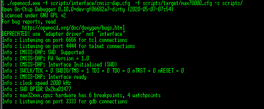
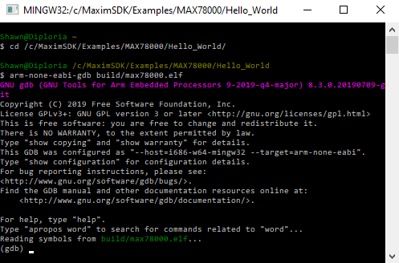

# Getting Started with the MAX78000 Evaluation Kit

## List of Evaluation Kit Components

Before beginning, you should make sure you have all of the following components of the evaluation kit.
  * *EV Kit board* - Note:  EV Kits come with MAX78000 device already inside the socket.  
  * Additional MAX78000 sample(s)
  * Maxim Pico JTAG/SWD adapter
  * USB cable(s)

## Powering the MAX78000 Evaluation Kit for the First Time

The MAX78000 Evaluation Kit (EV kit) comes preloaded with a MAX78000 device that has been preprogrammed with a sample application. This application blinks an LED and repeatedly outputs messages to its UART. Use this application to verify the hardware is connected and functioning properly.

1.  Begin by making sure the PWR switch (SW1) is in the "OFF" position.

2.  Connect USB cables from the PC to the USB/PWR connector (CN1) of the EV kit. This cable will power the board and provide a virtual serial port connection to the MAX78000's UART.

3.  On your PC, open a serial terminal application (minicom, gtkterm, etc.), and connect to the virtual serial port using a baud rate of 115200 and 8-N-1 settings.

4.  Move the PWR switch to the "ON" position.

5.  You will see message from the MAX78000 appear in the terminal and LED1 (D1) on the board will begin blinking at a steady rate.

Once you see the described behavior, you know your board is functioning properly.

## Installing the Developer Tools

There are a few tools you will need to build, load, run, and debug applications on the EV Kit.

-   The GNU Tools for ARM Embedded Processors

    1.  Browse to <https://developer.arm.com/tools-and-software/open-source-software/developer-tools/gnu-toolchain/gnu-rm/downloads> and download and extract the gcc-arm-none-eabi-9-2019-q4-major package that corresponds to your system.

    2.  Edit your PATH variable to include the path to the arm-none-eabi directory.

-   OpenOCD

    1.  Maxim provides pre-built binaries for the Ubuntu 18.04 LTS distribution. The binaries can be downloaded from <!--TBD-->.

    2.  You also have the option of building OpenOCD from source. Visit <https://github.com/MaximIntegratedMicros/openocd> and follow the instructions in the README found there.

-   The MAX78000 SDK

    1.  The SDK is hosted on GitHub and is a submodule of the ai8x-sythesis repository. To get the SDK and all the additional supporting files, clone the ai8x-sythesis repository found at https://github.com/MaximIntegratedAI/ai8x-synthesis.

## Building the SDK Examples

The SDK includes multiple examples to demonstrate the features of the MAX78000 and to show the use of the various functions available in the API. Each example includes a makefile that has been configured to work with the EV Kit. To build an example, simply change to the directory containing the example and run "make". When built, each example results in a max78000.elf (or max78000-combined.elf for projects involving both the RISC-V and ARM cores) file that can be found in the "build" directory of that example.

## Loading and Running Applications on the EV Kit

Applications are loaded, debugged, and run using OpenOCD and GDB.

1.  Connect the ribbon cable of the MAX32625PICO debug adapter to SWD connector (JH5) of the EV Kit.

2.  Connect a USB cable between the MAX32625PICO debug adapter and the PC.

3.  Change to the OpenOCD directory and launch OpenOCD with the following command:

    > ./openocd -f tcl/interface/cmsis-dap.cfg -f tcl/target/max78000.cfg

4.  On successful connection, you will see messages as shown below.

5.  From another command prompt, change to the directory containing the application you would like to load.

6.  Launch GDB using one of the following commands:

    > arm-none-eabi-gdb max78000.elf
    > arm-none-eabi-gdb max78000-combined.elf

7.  Connect GDB to OpenOCD and reset the MAX78000.

    > target remote localhost:3333
    > monitor reset halt

8.  Load and verify the application.

    > load
    > compare-sections

9.  Reset the device and run the application:

    > monitor reset halt
    > c

## Debugging Applications with GDB

Follow the same steps provided in the *Loading and Running Applications on the EV Kit* section. While the application is running, use \<CTRL-C\> to interrupt the application and halt its execution. The table below lists a few of the commands available to you any time the application is halted.

| **Command**                    | **Short Command** | **Description**                                              |
| ------------------------------ | ----------------- | ------------------------------------------------------------ |
| monitor halt                   |                   | Halt the microcontroller.                                    |
| monitor reset halt             |                   | Reset the microcontroller and immediately halt.              |
| monitor max32xxx mass\_erase 0 |                   | Mass erase the flash.                                        |
| continue                       | c                 | Continue execution.                                          |
| break \<arg\>                  | b \<arg\>         | Set a breakpoint. Argument can be function\_name, file:line\_number, or \*address. |
| print \<variable\>             | p                 | Print the value of a variable. Variable must be in current scope. |
| backtrace                      | bt                | Print contents of the stack frame.                           |
| step                           | s                 | Execute the next instruction.                                |
| next                           | n                 | Execute the next line of code.                               |
| finish                         | f                 | Continue to the end of the current function.                 |
| info reg                       |                   | Print the values of the ARM registers.                       |
| help                           |                   | Print descriptions for available commands                    |
| help \<cmd\>                   |                   | Print description for given command.                         |

## Additional SDK Information

The examples are separated by device type. The SDK on GitHub currently only includes the MAX78000. Therefore, the examples will be located in the Examples/MAX78000 folder. For each example, you will find the following files.

-   makefile -- This file contains the rules used to build the application with the "make" command. The binaries for each project can be removed with the "make clean" command. Use "make distclean" to remove the binaries for each project and any libraries the project depends on.

-   main.c -- This source file contains the entry point for the application.

-   \*.c -- These files contain additional source code required by the example if necessary. Many of the examples reside entirely in the main.c file and will not have additional .c files.

-   \*.launch, .cproject, and .project -- These files are the project files used in the Eclipse environment. They can be ignored when working with OpenOCD and GDB from the command line. (Note a few examples do not have Eclipse project files yet.)

The SDK provides an API for working with the device's components. To use the API, you will need to include the header (\*.h) files in your source code. The API header files for the MAX78000 reside in Libraries/PeriphDrivers/Include/MAX78000/. For convenience, you can include the "mxc.h" file in your source. This file includes the headers for all the supported peripheral libraries. Documentation for the functions contained in the API can be found at Libraries/PeriphDrivers/Documentation/MAX78000/index.html.

## Jumper Settings for the MAX78000 EV Kit

The jumpers on the board have been set to the proper position prior to shipment. There are a few that you may want to change based on the needs of your application.

| **Jumper Name** | **Description**                                              |
| --------------- | ------------------------------------------------------------ |
| JH1.P0\_2       | Connects the CTS signal of UART0 to the CTS signal of the USB to Serial convertor. |
| JH1.P0\_3       | Connects the RTS signal of UART0 to the CTS signal of the USB to Serial convertor. |
| JH1.P0\_0       | Connects the RX signal of UART0 to the TX signal of the USB to Serial convertor. |
| JH1.P0\_1       | Connects the TX signal of UART0 to the RX signal of the USB to Serial convertor. |
| JH2.P0\_13      | Connects the TX signal of UART1 to the RX signal of the USB to Serial convertor. |
| JH2.P0\_12      | Connects the RX signal of UART1 to the TX signal of the USB to Serial convertor. |
| JP1             | Allows P0.2 to the control the state of LED1 (D1).           |
| JP2             | Allows P0.3 to the control the state of LED2 (D2).           |
| JP7             | Enables the CNN BOOST circuitry. When this jumper is connected, use the \`\--boost 2.5\` command line argument to ai8xizer. This enables port 2.5 during CNN computation, which enables the current boost. |
| JP13            | Can be removed to measure the CNN current. To measure current connect a low impedance current meter across this jumper. If the meter is not low impedance, resister R14 should be removed from the board. |
