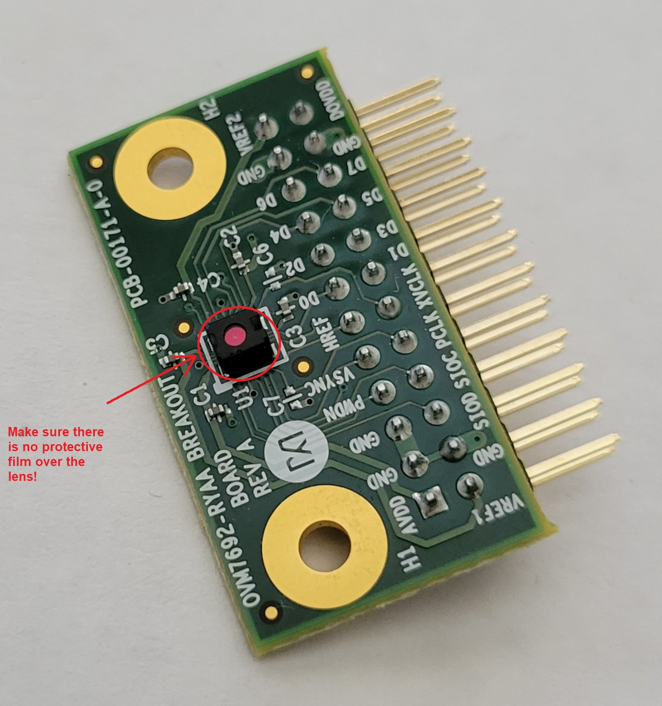
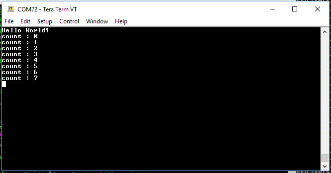

# Getting Started with the MAX78000 Evaluation Kit (EV Kit)

[TOC]

## List of Evaluation Kit Components

Before beginning, you should make sure you have all of the following components of the evaluation kit.

- EV Kit Board with Socketed MAX78000
- MAX32625PICO Debugger with Cables
- Olimex ARM-USB-OCD-H
- Olimex ARM-JTAG 20-10 ADAPTER
- Camera Module + right angle header adapter
- 2 USB-A to MICRO-B Cables
- 1 USB-A to USB-B Cable
- Extra Shunts

## Picture of EV Kit

## Picture of Camera Module

For demos that need the camera to work in selfie mode(e.g. faceID), please use the provided right angle adapter to connect the camera to the evkit.

**Make sure to remove all protective film from the camera lens.**

## EV Kit Schematic

EV Kit schematic: [Schematics](https://www.analog.com/en/design-center/evaluation-hardware-and-software/evaluation-boards-kits/max78000evkit.html)

## Powering the MAX78000 Evaluation Kit for the First Time

The MAX78000 Evaluation Kit (EV kit) comes preloaded with a MAX78000 device that has been preprogrammed with a sample application. This application blinks an LED and repeatedly outputs messages to its UART. Use this application to verify the hardware is connected and functioning properly.

1. Begin by making sure the PWR switch (SW1) is in the "OFF" position.

2. Make sure that jumper JP1 is installed.  This jumper enables LED, D1.  

3. Make sure that the P0_0 and P0_1 jumpers are installed on JH1.  These two jumpers connect UART0 RX and TX to the console output.

4. Connect USB cables from the PC to the USB/PWR connector (CN1) of the EV kit. This cable will power the board and provide a virtual serial port connection to the MAX78000's UART.

5. Install JP7 and JP14 to enable the external boost controller.

6. Move the PWR switch to the "ON" position.

7. On your PC, open a serial terminal application (minicom, gtkterm, etc.), and connect to the virtual serial port using a baud rate of 115200 and 8-N-1 settings.

8. Reset the EV kit via SW5.  You will see message from the MAX78000 appear in the terminal and LED1 (D1) on the board will begin blinking at a steady rate.

Once you see the described behavior, you know your board is functioning properly.

## Troubleshooting

If you do not get the expected results, here are some things to note.

- If the terminal program you are using says 'permission denied,' try prepending `sudo`.  For example, instead of typing 'gtkterm', type 'sudo gtkterm'.  Alternatively, ensure your user is part of the `dialout` group.
- If the serial port successfully opens, but nothing appears on the console output, press RESET on the EV Kit, SW5.
- Some early versions of the EV Kit did not pre-program the Hello World example, instead, they still have a test program in flash.  If you see a console output that starts with '***CNN Test*** ', you should also see '***PASS*** '.  In this case LED D1 should also be illuminated constantly.
- If you can no longer program the MAX78000, it may be in a locked-out state.  Refer to the "How to Unlock a MAX78000 That Can No Longer Be Programmed" section.
- If there are no signs-of-life (no LEDs blinking, no terminal output, no debugger communication), you can open the socket and inspect the MAX78000 to see if it is present and ball 1 is in the proper location.  Additional information regarding the socket and ball 1 indicators are provided below.  Be sure to power off the board before opening the socket.
- When UART0 RX (P0.0) is not connected (e.g., JH1-P0_0 open, or no external connection on CN1), both P0.0 and SWDCLK (P0.29) may be sensed as low during power up due to slow rise times. This is interpreted by the ROM as a boot loader entry request, and it interrupts the normal boot process. To ensure normal startup, place a 10kΩ pull-up resistor from P0.0 to 3.3V.

## Jumper Settings for the MAX78000 EV Kit

The jumpers on the board have been set to the proper position prior to shipment. There are a few that you may want to change based on the needs of your application.  Note: The complete list of jumpers can be found at: [jumper settings.xlsx](https://github.com/MaximIntegratedAI/MaximAI_Documentation/raw/master/MAX78000_Evaluation_Kit/jumper%20settings.xlsx)

| **Jumper Name** | **Description**                                              |
| --------------- | ------------------------------------------------------------ |
| JH1.P0\_2       | Connects the CTS signal of UART0 to the CTS signal of the USB to Serial converter. |
| JH1.P0\_3       | Connects the RTS signal of UART0 to the CTS signal of the USB to Serial converter. |
| JH1.P0\_0       | Connects the RX signal of UART0 to the TX signal of the USB to Serial converter. |
| JH1.P0\_1       | Connects the TX signal of UART0 to the RX signal of the USB to Serial converter. |
| JH2.P0\_13      | Connects the TX signal of UART1 to the RX signal of the USB to Serial converter. |
| JH2.P0\_12      | Connects the RX signal of UART1 to the TX signal of the USB to Serial converter. |
| JP1             | Allows P0.2 to the control the state of LED1 (D1).           |
| JP2             | Allows P0.3 to the control the state of LED2 (D2).           |
| JP7             | Enables the CNN BOOST circuitry. When this jumper is connected, use the \`\--boost 2.5\` command line argument to ai8xizer. This enables port 2.5 during CNN computation, which enables the current boost. |
| JP13            | Can be removed to measure the CNN current. To measure current connect a low impedance current meter across this jumper. If the meter is not low impedance, resister R14 should be removed from the board. |

## Proper installation of MAX78000 in the socket

In rare occasions, you may need to open the socket containing the MAX78000.  If there are no signs-of-life (no LEDs blinking, no terminal output, no debugger communication), you can open the socket and inspect the MAX78000 to see if it is present and ball 1 is in the proper location.  When looking at the top of the MAX78000 chip, the plus sign (+) indicates the corner containing ball 1.  Ball 1 of the MAX78000 needs to match the ball 1 location of the socket, which can be determined by looking at the PCB silkscreen (see picture below).  Other times this information is relevant is when the user wants to swap MAX78000s, for example, to program more than one device.

## Software Development

### Setup

Embedded development for the MAX78000EVKIT is enabled by the Maxim Microcontroller SDK (“MSDK”), now a part of Analog Devices.

See the [**MSDK User Guide**](https://analog-devices-msdk.github.io/msdk/USERGUIDE/) for detailed documentation on installation, setup, and getting started.

### How to Unlock a MAX78000 That Can No Longer Be Programmed

The SWD interface is unavailable for a certain number of clock cycles after reset.  If the application code instructs the device to enter any low power or shutdown mode too soon, it could be difficult to reprogram the device.  The following instructions help recover a device in this lockout state:  

1. Remove the USB cable connected to the MAX32625PICO debug adapter board.  
2. Remove power to the target device by powering down the EV Kit or feather board.  
3. Place the MAX32625PICO debug adapter in MAINTENANCE mode by holding down its button while reconnecting the USB cable to the host PC.  

   - The MAX32625PICO debug adapter will enumerate as a mass storage device named MAINTENANCE.  
   - Drag-n-Drop the provided bin file to the drive named MAINTENANCE:  [DAPLINK bin file](https://github.com/MaximIntegratedAI/MaximAI_Documentation/raw/master/MAX78000_Evaluation_Kit/MAX32625PICO_files/max32625_max78000fthr_if_crc_v1.0.2.bin).  
   - Following the Drag-n-Drop, the MAX32625PICO should reboot and reconnect as a drive named DAPLINK.  

4. Make sure the 'Automation allowed' field is set to 1 in the DETAILS.TXT file on the DAPLINK drive. If not, perform the following steps:
    - Create an empty text file named '**auto_on.cfg**'. Copy the file to DAPLINK drive while its button is held.
    - Release the button when the drive unmounts. When it remounts, confirm "Automation allowed" is set to 1 in DETAILS.TXT file.
5. Create an empty text file named '**erase.act**' and Drag-and-drop it onto the DAPLINK drive.
6. This should mass erase the flash of the target device, allowing the device to be programmed again.

At this point, the target device should be once again programmable.

Note:  In order to avoid the locked out state to begin with, it is recommended that during code development, a delay be placed at the beginning of user code in order to give the debug adapter an opportunity to communicate with or halt the processor.  A delay of 2 seconds is ideal so that the debugger can be attached manually.

## Machine Learning (ML) Development

As the MAX78000 contains a powerful Convolution Neural Network (CNN) accelerator, there is also the Machine Learning side of development. This is done with a separate set of tools. The example projects that are found in the `CNN` sub-folder of the MAX78000 examples have been created with these tools. More specifically, they have been created with the `ai8x-synthesis` (“izer”) tool, which converts a trained model into C code that can be compiled and flashed onto the MAX78000.

### ML Overview

The documentation associated with the setup and usage of these tools is significant. Here are the links to get started:

* [Analog Devices AI Github Repository](https://github.com/maximintegratedAI)
* [ai8x-synthesis tool](https://github.com/MaximIntegratedAI/ai8x-synthesis)
* [ai8x-training tool](https://github.com/MaximIntegratedAI/ai8x-training)
* [Workflow Guide](https://github.com/MaximIntegratedAI/MaximAI_Documentation/blob/master/Guides/MAX78000_Workflow_Guide.md#max78000-workflow-guide)

### ML Videos

A large technical library of technical training videos on Artificial Intelligence (AI) and the MAX78000/MAX78002 is available via the links below. These are the best way to get started with ML on the MAX78002.  The “Understanding Artificial Intelligence” series is highly recommended for all developers.

- **Understanding Artificial Intelligence**
  - [Episode 1 - Who Needs Machine Learning Anyways?](https://www.analog.com/en/education/education-library/videos/6313215159112.html)
  - [Episode 2 - Thinking About Machine Learning](https://www.analog.com/en/education/education-library/videos/6313214510112.html)
  - [Episode 3 - All About Models](https://www.analog.com/en/education/education-library/videos/6313216827112.html)
  - [Episode 4 - All About Training](https://www.analog.com/en/education/education-library/videos/6313215699112.html)
  - [Episode 5 - Say Hello to the MAX78000](https://www.analog.com/en/education/education-library/videos/6313217809112.html)
  - [Episode 6 - From Checkpoint to C](https://www.analog.com/en/education/education-library/videos/6313215449112.html)
  - [Episode 7 - How to Train a Network](https://www.analog.com/en/education/education-library/videos/6313213231112.html)
  - [Episode 8 - The MAX78000FTHR](https://www.analog.com/en/education/education-library/videos/6313213346112.html)
  - [Episode 8.5 - Visual Studio Code](https://www.analog.com/en/education/education-library/videos/6313212752112.html)

### ML Setup

The setup and usage of the machine learning tools is thoroughly documented in the [README.md](https://github.com/MaximIntegratedAI/ai8x-synthesis/blob/develop/README.md) file that can be found in the root directory of both the “izer” and training tools. See the [Installation](https://github.com/MaximIntegratedAI/ai8x-training/blob/develop/README.md#installation) section for detailed instructions.

### ML Usage

Detailed usage of the “izer” and training tools is beyond the scope of this document. The [Workflow Guide](https://github.com/MaximIntegratedAI/MaximAI_Documentation/blob/master/Guides/MAX78000_Workflow_Guide.md) is a great introduction.

Additionally, the [README](https://github.com/MaximIntegratedAI/ai8x-synthesis/blob/develop/README.md) contains all of the usage information for the tools.

Below are a few exercises to get started after setup is complete:

* Run the `gen-demos-max78000.sh` script found in the root directory of the “izer” tool and reference its [Command Line Arguments](https://github.com/MaximIntegratedAI/ai8x-synthesis#command-line-arguments-3) table to see how it works.

* Build and flash the output of one of the `gen-demos-max78000.sh` projects and verify that the generated “known answer” test passes.

* Locate the YAML files for the pre-trained models in the “izer” tool and reference the [YAML Network Description](https://github.com/MaximIntegratedAI/ai8x-synthesis#yaml-network-description) to see how they work.

* Run `train_all_models.sh` from the training repository and reference its [Command Line Arguments](https://github.com/MaximIntegratedAI/ai8x-training#command-line-arguments) to see how it works.

* Familiarize yourself with the concept of data loaders with [Application Note 7600](https://www.maximintegrated.com/en/design/technical-documents/app-notes/7/7600.html) and explore the pre-written data loaders found in the [datasets](https://github.com/MaximIntegratedAI/ai8x-training/tree/develop/datasets) directory of the training tool.

### CNN Boost

The EV kit features an external boost circuit that can be used to supply the CNN when under high computational load.  The boost circuit is enabled by jumping JP7 and J14 as described previously and supplying the `--boost 2.5` command line argument to ai8xizer.
The internal SIMO can be used to power the CNN under moderate computational loads, however, the external boot circuit is recommended during development to avoid SIMO brown-out due to transient over-current conditions which can cause the CNN to fail.

### Links to mnist and additional CNN examples

- [mnist CNN example](https://github.com/Analog-Devices-MSDK/msdk/tree/master/Examples/MAX78000/CNN/mnist)
- [Directory of additional CNN examples](https://github.com/Analog-Devices-MSDK/msdk/tree/master/Examples/MAX78000/CNN)

## Power Monitor Sub-Circuit

The MAX78000EVKIT includes a dedicated power-monitoring sub-circuit (PMON) that allows the user to measure the power consumption of the MAX78000 to determine the active and idle power, and the energy and time to perform CNN inferences as well as kernel and data loading. This separate sub-circuit can be found in the bottom right corner of the board and has its own TFT display, USB virtual serial port, and microcontroller.

Detailed usage information on the PMON operation, including measurements, how to instrument code and updating the firmware is available in the [MAX7800x Power Monitor and Energy Benchmarking Guide](https://github.com/MaximIntegratedAI/MaximAI_Documentation/blob/master/Guides/MAX7800x%20Power%20Monitor%20and%20Energy%20Benchmarking%20Guide.md).
