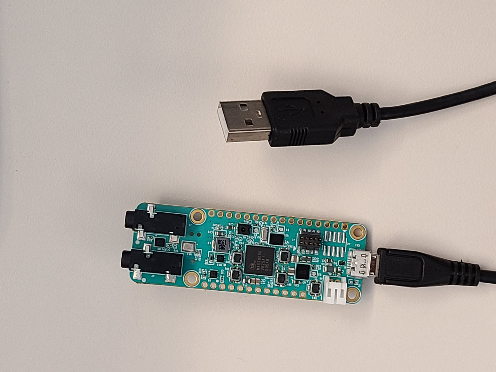
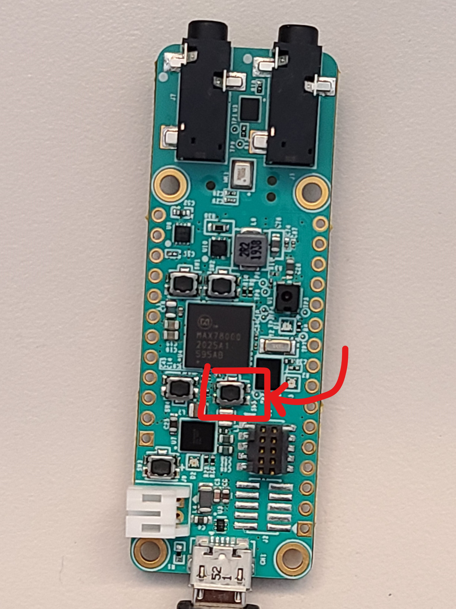
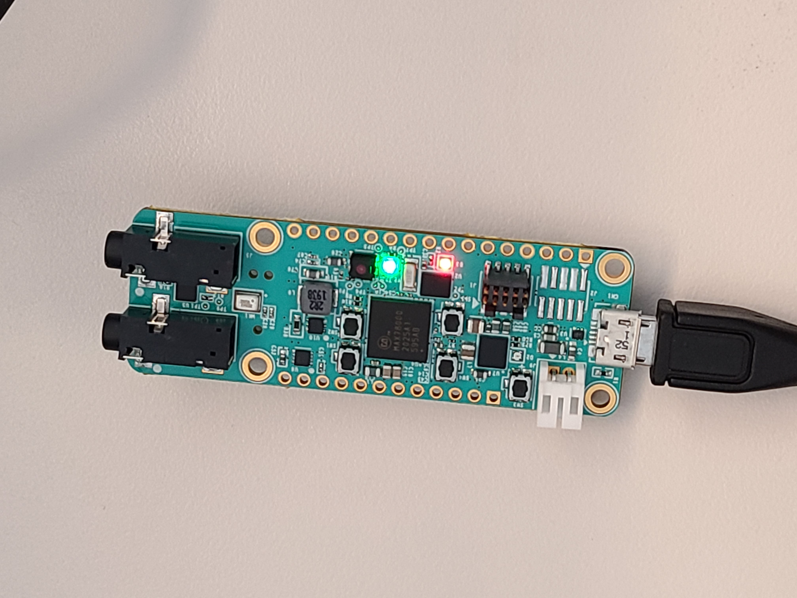
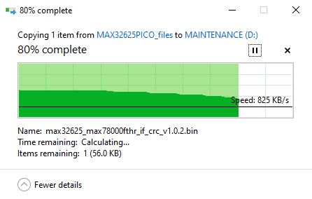
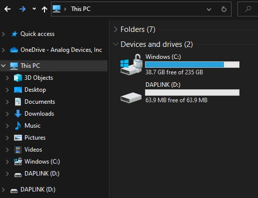
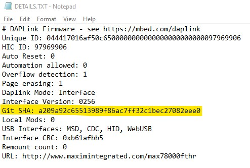
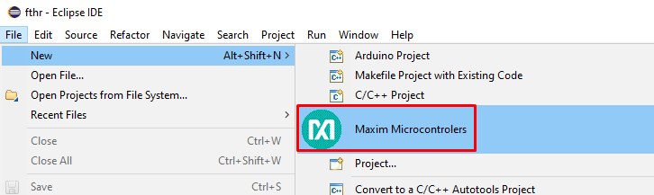
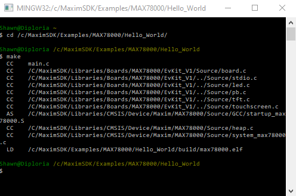

# Getting Started with the MAX78000FTHR

- [Getting Started with the MAX78000FTHR](#getting-started-with-the-max78000fthr)
  - [Schematic](#schematic)
  - [Developing with Eclipse](#developing-with-eclipse)
    - [Running Eclipse](#running-eclipse)
    - [Creating a I/O Peripheral Project](#creating-a-io-peripheral-project)
    - [Creating a CNN Project from an Example](#creating-a-cnn-project-from-an-example)
  - [Building the SDK Examples using MINGW on Windows](#building-the-sdk-examples-using-mingw-on-windows)
  - [Loading and Running Example Firmware](#loading-and-running-example-firmware)
  - [Debugging Applications with GDB](#debugging-applications-with-gdb)
  - [How to Unlock a MAX78000 That Can No Longer Be Programmed](#how-to-unlock-a-max78000-that-can-no-longer-be-programmed)
  - [Additional SDK Information](#additional-sdk-information)
  - [TFT display](#tft-display)
  - [ML-Focused Approach using Linux](#ml-focused-approach-using-linux)
  - [Installing the Developer Tools (Linux)](#installing-the-developer-tools-linux)
  - [Next Steps:  Loading and running the included **mnist** CNN example](#next-steps--loading-and-running-the-included-mnist-cnn-example)
    - [CNN Boost](#cnn-boost)
    - [Links to mnist and additional CNN examples](#links-to-mnist-and-additional-cnn-examples)
  - [Going beyond the included CNN examples - Advanced Topics](#going-beyond-the-included-cnn-examples---advanced-topics)

---


## Schematic

The schematic and BOM can be found in the MAX78000FTHR [Datasheet](<https://www.maximintegrated.com/en/products/microcontrollers/MAX78000FTHR.html>).

## First-time Firmware Updates

The MAX78000FTHR has an integrated MAX32625PICO ("PICO") debug adapter.  The firmware for this debugger should be updated to the latest version before development.  These updates contain bug fixes and improvements that are required to ensure proper operation of the debugger.

### Updating the MAX32625PICO ("PICO") Debug Adapter Firmware

1. Download the "max32625_max78000fthr_if_crc_v1.0.2.bin" file from [this](https://github.com/MaximIntegratedMicros/max32625pico-firmware-images/raw/main/bin/max32625_max78000fthr_if_crc_v1.0.2.bin) link.  

2. Connect the included micro-USB cable to the MAX78000FTHR _without_ connecting the other side of the cable to your host PC yet.

    

3. Press and hold the SW5 pushbutton.

    

4. _While holding down the SW5 pushbutton_ connect the other side of the micro-USB cable to your host PC.  

    Keep the pushbutton held down until the red LED (D3) on the MAX78000FTHR blinks and becomes solid.

    

5. A "MAINTENANCE" drive should now appear on your file system.

    

    Note:  If a DAPLINK drive presents itself instead, retry the connection while holding the pushbutton down.  Holding SW5 while connecting the FTHR board will place it in MAINTENANCE mode, allowing its debugger firmware to be reprogrammed.

6. Drag and drop the "max32625_max78000fthr_if_crc_v1.0.2.bin" file onto the MAINTENANCE drive.  This will flash the "PICO" with the updated firmware.

<<<<<<< HEAD
    

    

    
=======
    1. 

    2. 

    3. 
>>>>>>> 207b4f43efc2f41314c2ad983d653445d697636f

7. Once the flashing is complete, the "PICO" will restart and present itself as a "DAPLINK" drive.

    

8. Open the DAPLINK drive.

    

9. Open the "DETAILS.TXT" file and verify the contents match the "MAX32625PICO_files/DETAILS.TXT" file in this repository.  Specifically - the "Git SHA" field should match exactly.

    

10. Your "PICO" debugger is now ready to use with the MAX78000FTHR.

## Developing with Eclipse

This is the quickest way to evaluate pre-trained and synthesized ML demonstrations.  You'll need to download and install the Maxim SDK onto a Windows 10 host. The Maxim SDK is available to download from [here](<https://www.maximintegrated.com/content/maximintegrated/en/design/software-description.html/swpart=SFW0010820A>).

### Running Eclipse

If you are using Microsoft Windows, it is very important to run Eclipse from the _Windows Start Menu_. Failing to do so may results in unexpected Eclipse behavior during build and debug of your code.


### Creating a I/O Peripheral Project

The SDK contains example projects for all integrated peripherals, such as I2C, GPIO, and UART.  These can be used as a template for your own projects. To do this select "New"->"Maxim Microcontrollers" within Eclipse as demonstrated below.



Enter a name for your project and click 'Next'.

The 'Select Project Configuration' dialog can be configure as follows:


The 'Select example type' can be any firmware example you are interested in.  Note that the CNN-specific examples are not listed here.  CNN examples must be imported via a different mechanism explained below.

If you are using the PICO debugger, set the adapter type to MAX32625_PICO.  If you are using the Olimax debugger, set the adapter type to CMSIS-DAP.

Click 'Finish' and Eclipse will open your project and you may edit, compile, and debug.

### Creating a CNN Project from an Example

If you are interested in the CNN examples, you can use "File->Import" within Eclipse to import them into your workspace. When prompted, select 'Existing Projects into Workspace'


You need to provide the path to the CNN examples within the SDK tree similar to the image below.  The path will depend on where you installed the SDK.


The Maxim SDK comes with many convolutional neural network demonstrations which can be imported into Eclipse.  These firmware examples can be found within the SDK in Examples\MAX78000\CNN.  Choose "File"->"Import" and then select "General->Existing Projects into Workspace".  Using the subsequent dialogs, navigate to Examples\MAX78000\CNN and import all firmware projects that you are interested in.  You'll find peripheral-oriented examples for the MAX78000 in the Examples\MAX78000 directory.

All CNN examples will run on the MAX78000EVKIT, but not all a currently supported on the MAX78000FTHR.  Here's a list of examples that are supported on the MAX78000FTHR:

- cifar-10
- cifar-100
- mnist
- mnist-riscv
- mnist-streaming
- kws20_v3
- kws20_demo
- faceid
- faceid_demo
- faceid_evkit
- cats-dogs_demo
- rps
- snake_game_demo

Note that all examples are targeted at the EVKIT by default.  To change the target to the FTHR, you must pass BOARD=FTHR_RevA to make.  This can be accomplished within Eclipse on a per-project basis as follows:


The Firmware-Focused Approach allows you to quickly compile, modify, and debug existing CNN examples, but if you want to modify the ML models or re-train the ML network, you will need to use the ML-focused approach described in the next section.

## Building the SDK Examples using MINGW on Windows

The SDK includes multiple examples to demonstrate the features of the MAX78000 and to show the use of the various functions available in the API. Each example includes a makefile that has been configured to work with the EV Kit. To build an example, simply change to the directory containing the example and run "make". When built, each example results in a max78000.elf (or max78000-combined.elf for projects involving both the RISC-V and ARM cores) file that can be found in the "build" directory of that example.

On Windows, the MSYS shell (included in the SDK) can be used to build examples.  Start 'msys.bat' to launch the shell.  The shell can be accessed from the Windows Start Menu or in the default installation directory show below.


Below is an example of how to build the "hello world" example.  Other tools, such as openocd and gdb can be accessed from the MinGW shell.



## Loading and Running Example Firmware

Applications are loaded, debugged, and run using OpenOCD and GDB.  This section shows how to do this specifically with MSYS on Windows, but very similar methods can be used under Linux.  In fact, if you prefer to develop using Linux, see the section [Installing the Developer Tools \(Linux\)](#installing-the-developer-tools-linux) below.

The MAX78000FTHR has an integrated daplink debugger.

1. Connect the FTHR to your host PC with a USB cable.  Windows will enumerate a daplink device and-thumb drive device.

2. Change to the OpenOCD directory and launch OpenOCD with the following command:

    ```bash
    openocd -f interface/cmsis-dap.cfg -f target/max78000.cfg -s/c/MaximSDK/Tools/OpenOCD/scripts
    ```

3. On successful connection, you will see messages as shown below.

     

4. From another command prompt, change to the directory containing the application you would like to load.

    

5. Launch GDB using one of the following commands:

    ```bash
    arm-none-eabi-gdb max78000.elf
    arm-none-eabi-gdb max78000-combined.elf
    ```

6. Connect GDB to OpenOCD and reset the MAX78000.

    ```bash
    target remote localhost:3333
    monitor reset halt
    ```

7. Load and verify the application.

    ```bash
    load
    compare-sections
    ```

8. Reset the device and run the application:

    ```bash
    monitor reset halt
    c
    ```

## Debugging Applications with GDB

Follow the same steps provided in the *Loading and Running Applications on the EV Kit* section. While the application is running, use \<CTRL-C\> to interrupt the application and halt its execution. The table below lists a few of the commands available to you any time the application is halted.

| **Command**                    | **Short Command** | **Description**                                              |
| ------------------------------ | ----------------- | ------------------------------------------------------------ |
| monitor halt                   |                   | Halt the microcontroller.                                    |
| monitor reset halt             |                   | Reset the microcontroller and immediately halt.              |
| monitor max32xxx mass\_erase 0 |                   | Mass erase the flash.                                        |
| continue                       | c                 | Continue execution.                                          |
| break \<arg\>                  | b \<arg\>         | Set a breakpoint. Argument can be function\_name, file:line\_number, or \*address. |
| print \<variable\>             | p                 | Print the value of a variable. Variable must be in current scope. |
| backtrace                      | bt                | Print contents of the stack frame.                           |
| step                           | s                 | Execute the next instruction.                                |
| next                           | n                 | Execute the next line of code.                               |
| finish                         | f                 | Continue to the end of the current function.                 |
| info reg                       |                   | Print the values of the ARM registers.                       |
| help                           |                   | Print descriptions for available commands                    |
| help \<cmd\>                   |                   | Print description for given command.                         |

## How to Unlock a MAX78000 That Can No Longer Be Programmed

The SWD interface is unavailable for a certain number of clock cycles after reset.  If the application code instructs the device to enter any low power or shutdown mode too soon, it could be difficult to reprogram the device.  The following instructions help recover a device in this "lockout" state.

1. Remove the USB cable connected to the MAX78000FTHR board.  
2. Place the on-board debug adapter in MAINTENANCE mode by holding down button SW5 while reconnecting the USB cable to the host PC.  
   - The debug adapter will enumerate as a mass storage device named MAINTENANCE.  
   - Drag-and-drop the provided bin file to the drive named MAINTENANCE:  [DAPLINK binary file](https://github.com/MaximIntegratedMicros/max32625pico-firmware-images/blob/main/bin/max32625_max78000fthr_if_crc_v1.0.2.bin).  
   - Following the Drag-and-drop, the debug adapter should reboot and reconnect as a drive named DAPLINK.  
3. Make sure the 'Automation allowed' field is set to 1 in the DETAILS.TXT file on the DAPLINK drive. If not, perform the following steps:
    - Create an empty text file named '**auto_on.cfg**'. Copy the file to DAPLINK drive while SW5 button is held.
    - Release SW5 button when the drive unmounts. When it remounts, confirm "Automation allowed" is set to 1 in DETAILS.TXT file.
4. Create an empty text file named '**erase.act**' and Drag-and-drop it onto the DAPLINK drive.
5. This should mass erase the flash of the target device, allowing the device to be programmed again.

At this point, the target device should be once again programmable.  

Note:  In order to avoid the locked out state to begin with, it is recommended that during code development, a delay be placed at the beginning of user code in order to give the debug adapter an opportunity to communicate with or halt the processor.  A delay of 2 seconds is ideal so that the debugger can be attached manually.  

## Additional SDK Information

The examples are separated by device type. The SDK on GitHub currently only includes the MAX78000. Therefore, the examples will be located in the Examples/MAX78000 folder. For each example, you will find the following files:

- makefile -- This file contains the rules used to build the application with the "make" command. The binaries for each project can be removed with the "make clean" command. Use "make distclean" to remove the binaries for each project and any libraries the project depends on.

- main.c -- This source file contains the entry point for the application.

- \*.c -- These files contain additional source code required by the example if necessary. Many of the examples reside entirely in the main.c file and will not have additional .c files.

- \*.launch, .cproject, and .project -- These files are the project files used in the Eclipse environment. They can be ignored when working with OpenOCD and GDB from the command line. (Note a few examples do not have Eclipse project files yet.)  For more information on using Eclipse, see ["Getting Started with Eclipse"](https://pdfserv.maximintegrated.com/en/an/TUT6245.pdf)

The SDK provides an API for working with the device's components. To use the API, you will need to include the header (\*.h) files in your source code. The API header files for the MAX78000 reside in Libraries/PeriphDrivers/Include/MAX78000/. For convenience, you can include the "mxc.h" file in your source. This file includes the headers for all the supported peripheral libraries. Documentation for the functions contained in the API can be found at Libraries/PeriphDrivers/Documentation/MAX78000/index.html.

## TFT display

The TFT display is optional and not supplied with the MAX78000 Feather board.

The MAX78000 Feather compatible 2.4'' TFT FeatherWing display can be ordered [here](<https://learn.adafruit.com/adafruit-2-4-tft-touch-screen-featherwing>).

This TFT display comes fully assembled with dual sockets for MAX78000 Feather to plug into.

To connect TFT display to MAX78000 Feather board you need to solder two headers as shown below:


While using TFT display keep its power switch in "ON" position. The TFT "Reset" button also can be used as Feather reset.

## ML-Focused Approach using Linux

This approach allows the user to train and synthesize convolutional neural networks using Pytorch and TensorFlow.  Additionally, compilation and debugging is supported under Linux making this method preferable for most developers that do not require Eclipse and are comfortable using bash, openOCD, and GDB directly.  Additionally, augmented ML toolchains, MAX78000-specific synthesis tools and supporting software are made available via github.

Two github repositories are required:  

<https://github.com/MaximIntegratedAI/ai8x-training>

<https://github.com/MaximIntegratedAI/ai8x-synthesis>

Refer to the readme found in each repository for details on how to configure your Linux host.

Additional repositories of interest include documentation and early-release versions of the Maxim SDK:

<https://github.com/MaximIntegratedAI/MaximAI_Documentation>

<https://github.com/MaximIntegratedAI/MAX78000_SDK>

## Installing the Developer Tools (Linux)

In addition to Windows+Eclipse, you can compile, flash, and debug firmware under Linux:

- The GNU Tools for ARM Embedded Processors

    1. Browse to [here](<https://developer.arm.com/tools-and-software/open-source-software/developer-tools/gnu-toolchain/gnu-rm/downloads>) and download and extract the gcc-arm-none-eabi-9-2019-q4-major package that corresponds to your system.

    2. Edit your PATH variable to include the path to the arm-none-eabi directory.

- The MAX78000 SDK

    1. The SDK is hosted on GitHub and is a submodule of the ai8x-synthesis repository. To get the SDK and all the additional supporting files, clone the ai8x-synthesis repository (including submodules) found at <https://github.com/MaximIntegratedAI/ai8x-synthesis>.

- OpenOCD

    1. Maxim provides pre-built binaries for the Ubuntu 18.04 LTS distribution. These should automatically be installed along with the SDK above.  However, if not, the binaries can be downloaded from [here](https://github.com/MaximIntegratedAI/MAX78000_SDK/tree/master/Tools/OpenOCD).

    2. You also have the option of building OpenOCD from source. Visit [here](<https://github.com/MaximIntegratedMicros/openocd>) and follow the instructions in the README found there.

## Next Steps:  Loading and running the included **mnist** CNN example

Now that proper operation of the MAX78000FTHR has been established by running a simple demo and observing the expected LED and console output, the next step is to run the included 'Hello World' of CNNs, the **mnist** example.  

### CNN Boost

The MAX78000FTHR features an external boost circuit that can be used to supply the CNN when under high computational load.  The boost circuit is enabled by  supplying the `--boost 2.5` command line argument to ai8xizer.

The internal SIMO can be used to power the CNN under moderate computational loads, however, the external boot circuit is recommended during development to avoid SIMO brown-out due to transient over-current conditions which can cause the CNN to fail.

### Links to mnist and additional CNN examples

- [mnist CNN example](https://github.com/MaximIntegratedAI/MAX78000_SDK/tree/master/Examples/MAX78000/CNN/mnist)
- [Directory of additional CNN examples](https://github.com/MaximIntegratedAI/MAX78000_SDK/tree/master/Examples/MAX78000/CNN)

## Going beyond the included CNN examples - Advanced Topics

- [AI8X Model Training and Quantization](https://github.com/MaximIntegratedAI/ai8x-synthesis/blob/master/README.md)
- [AI8X Network Loader and RTL Simulation Generator](https://github.com/MaximIntegratedAI/ai8x-synthesis/blob/master/README.md)
