# MAX78002EVKIT Quick-Start Guide

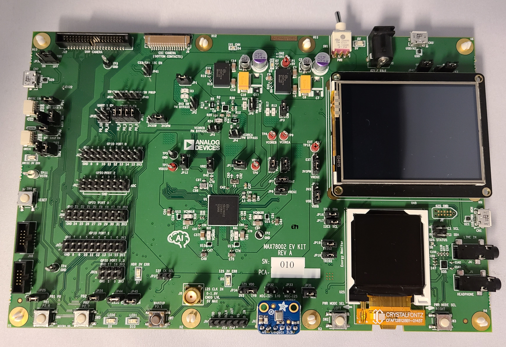

---

[TOC]

---

## Introduction

This quick-start document contains info on getting started with the MAX78002EVKIT evaluation platform. It supplements the full MAX78002EVKIT datasheet with information on software development and quick tips for getting started.

## Schematic and BOM

The schematic and BOM can be found in the [MAX78002 EVKIT web page](https://www.analog.com/en/design-center/evaluation-hardware-and-software/evaluation-boards-kits/max78002evkit.html).

## First-time Firmware Updates

The firmware for the MAX32625PICO (PICO) debug adapter should be updated before using the MAX78002EVKIT. These updates contain bug fixes and improvements that are required to ensure proper operation of the kit.

### Updating the MAX32625PICO (PICO) Debug Adapter Firmware

1. Download the [`max32625_max78000fthr_if_crc_v1.0.2.bin`](https://github.com/MaximIntegratedAI/MaximAI_Documentation/raw/master/MAX78002_Evaluation_Kit/MAX32625PICO_files/max32625_max78000fthr_if_crc_v1.0.2.bin) file.

    If you have cloned this repository, the file can also be found in the `MAX78002_Evaluation_Kit/MAX32625PICO_files` folder.

2. Connect the included micro-USB cable to the PICO _without_ connecting the other side of the cable to your host PC yet.

    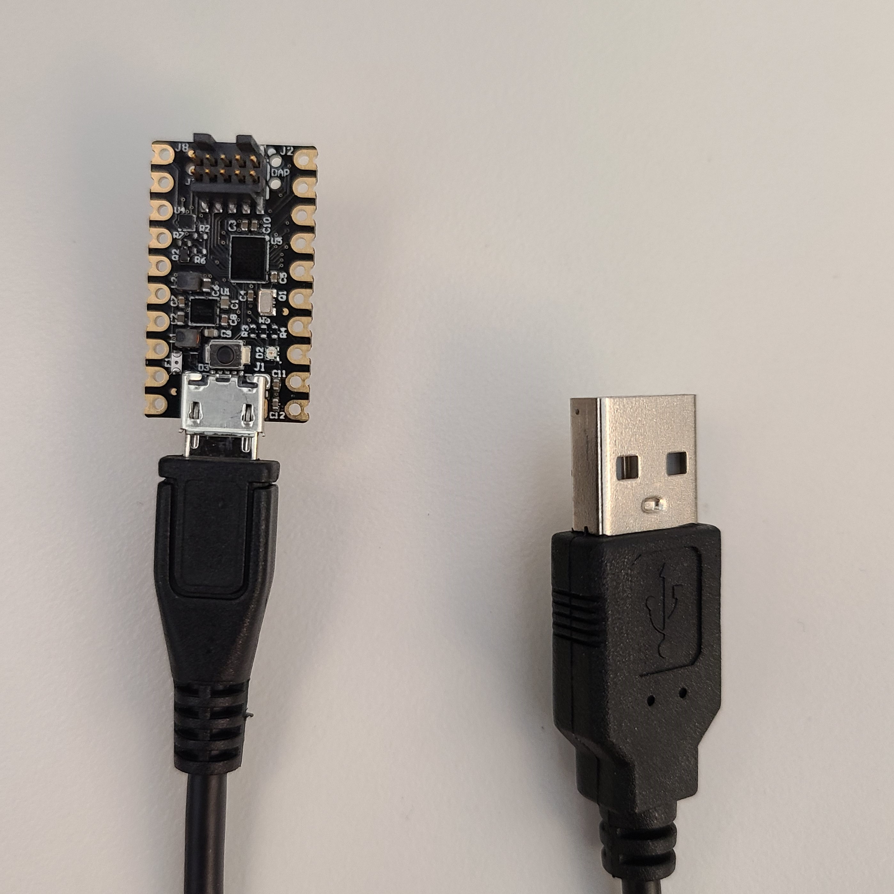

3. Press and hold the pushbutton on the top of the PICO.

    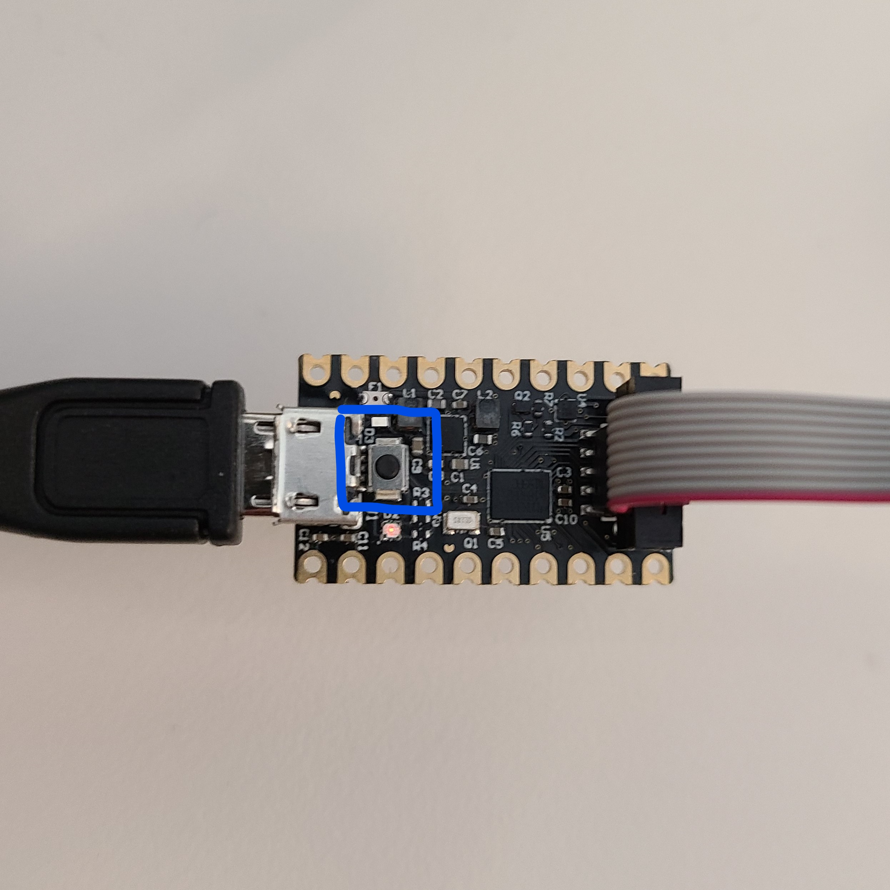

4. _While holding down the pushbutton on the PICO_ connect the other side of the micro-USB cable to your host PC.

    Keep the pushbutton held down until the LED on the PICO blinks and becomes solid.

    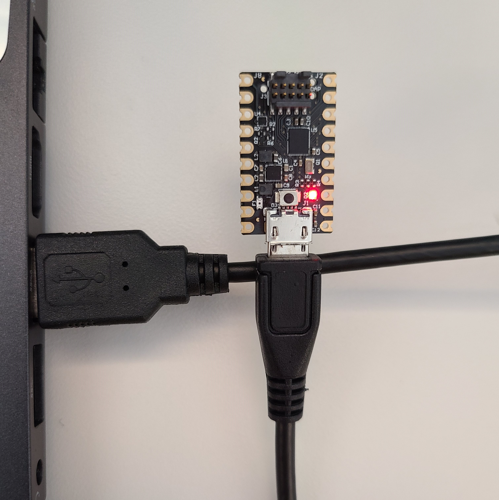

5. A `MAINTENANCE` drive should now appear on your file system.

    

6. Drag and drop the [`max32625_max78000fthr_if_crc_v1.0.2.bin`](https://github.com/MaximIntegratedAI/MaximAI_Documentation/raw/master/MAX78002_Evaluation_Kit/MAX32625PICO_files/max32625_max78000fthr_if_crc_v1.0.2.bin) file onto the `MAINTENANCE` drive. This will flash the PICO with the updated firmware.

    

    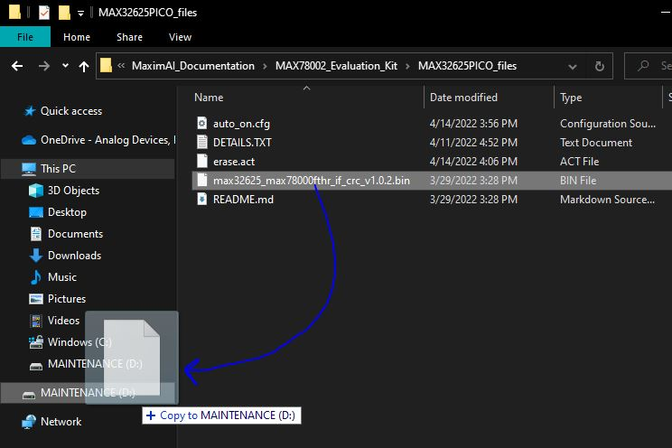

    

7. Once the flashing is complete, the PICO will restart and present itself as a `DAPLINK` drive.

    

8. Open the `DAPLINK` drive.

    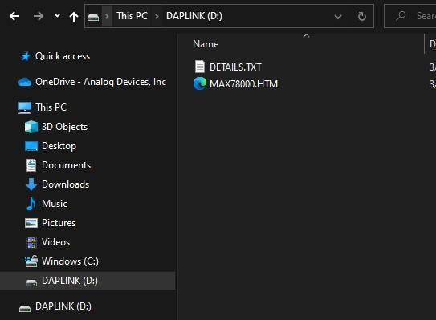

9. Open the `DETAILS.TXT` file and verify the contents match the [`MAX32625PICO_files/DETAILS.TXT`](https://github.com/MaximIntegratedAI/MaximAI_Documentation/raw/master/MAX78002_Evaluation_Kit/MAX32625PICO_files/DETAILS.TXT) file in this repository. Specifically - the “Git SHA” field should match exactly.

    

10. Your PICO debugger is now ready to use with the MAX78002EVKIT.

## Powering and Connecting to the Evaluation Kit

### Power Supply

The MAX78002EVKIT requires an external 5V supply power supply. A 5V wall adapter is supplied in the box. Connect the 5V wall adapter to the “5V IN” barrel jack connector (J1).


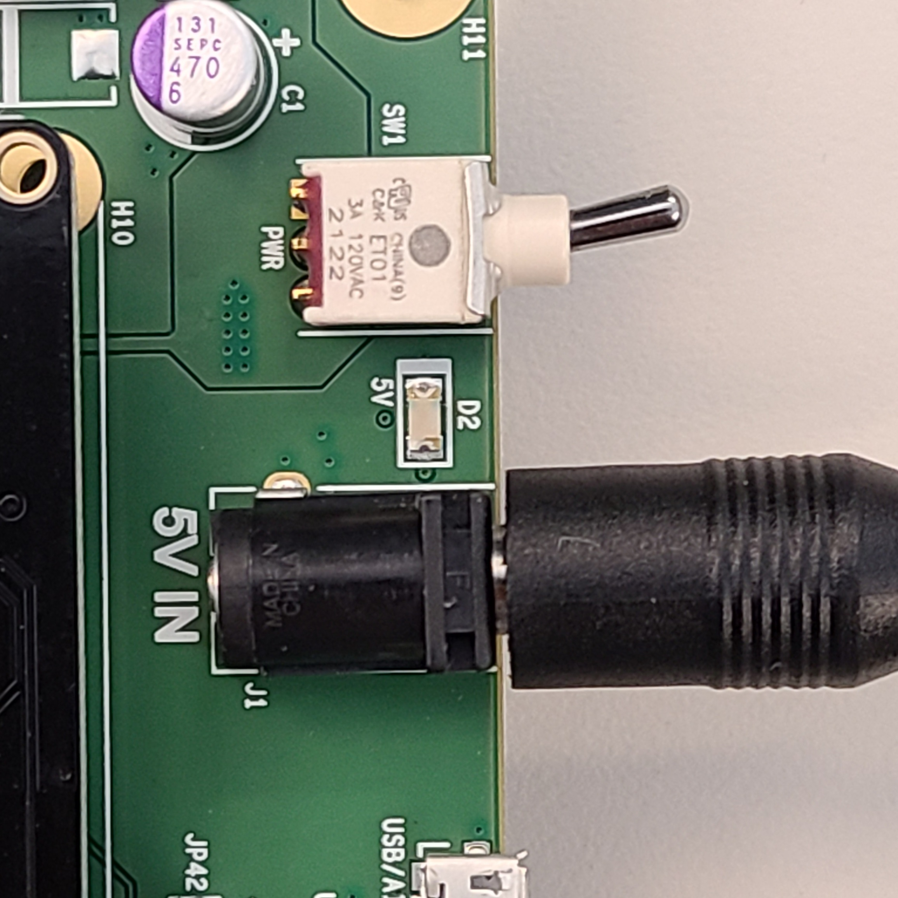

SW1 (labeled “PWR”) is the main power switch. With 5VIN supplied, flip the switch to power the rest of the board. The “5V” status LED (D2), “1V1 CNN” (D4), and “3V3” (D3) status LEDs will turn on and can be used to verify the board is powered on successfully.

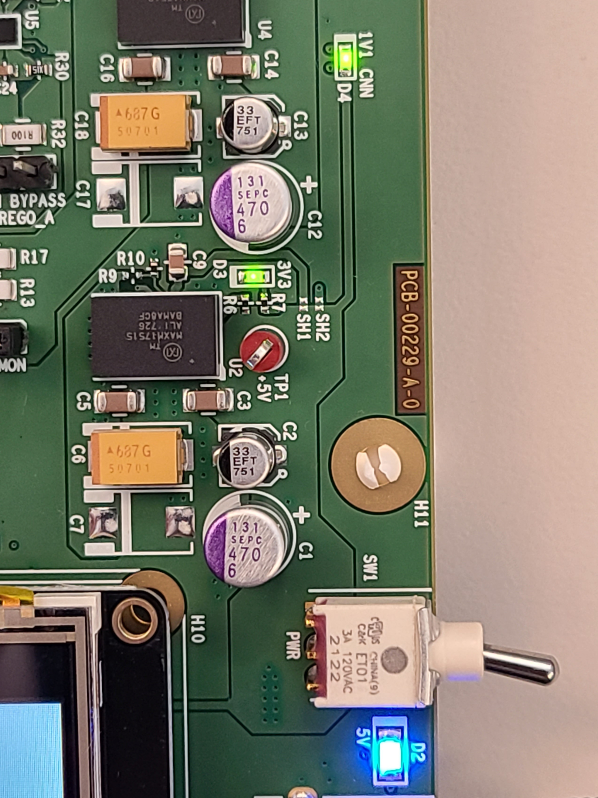

### Connecting Debug Adapters

The MAX78002 is a dual-core microcontroller, with both an Arm Cortex M4 core and a RISC-V core. As a result, the EVKIT comes with two debug adapters:

A MAX32625PICO:

* For use with the Arm Cortex M4 core
* Connects to the “SWD” debug header (JH8)

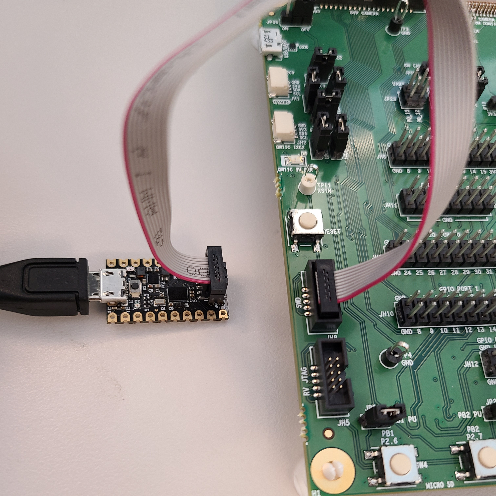

An Olimex [ARM-USB-OCD-H](https://www.olimex.com/Products/ARM/JTAG/ARM-USB-OCD-H/) + [ARM-JTAG 20-10 adapter](https://www.olimex.com/Products/ARM/JTAG/ARM-JTAG-20-10/):

* For use with the RISC-V core
* Connects to the “RV JTAG” debug header (JH5)
* This RISC-V debug adapter needs to be connected only for debugging the RISC-V core, but not for loading in general. Many of the examples in the MSDK are Arm-only.
* RISC-V debugging does, in general, also require simultaneous debugging of the Arm M4 core.

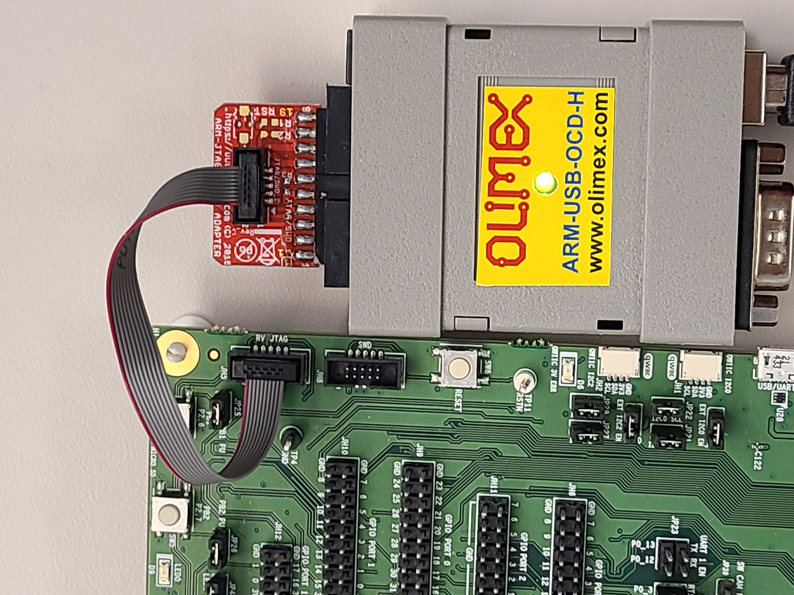

### Connecting Serial Ports

The MAX78002EVKIT exposes 3 serial ports via micro-USB connectors.

### “USB/UART” (CN2)

This serial port routes UART0 and UART1 from the MAX78002 to an [FT231XS](https://ftdichip.com/products/ft231xs/) UART to USB adapter. This is the default serial port used by most examples.

To communicate over this port, connect a micro-USB cable from the host PC to CN2. Most Operating Systems will auto-install the required drivers or already include them on the system, and the FT231XS chip will present itself as a Virtual COM Port (VCP).

If the port does _not_ present itself, then manual driver installation is required. See [this](https://ftdichip.com/drivers/vcp-drivers/) page from the official FTDI site.

ADI’s examples use the following serial communication settings by default:

* BAUD Rate: 115200
* Data: 8-bit
* Parity: None
* Stop bits: 1
* Flow control: None

Serial communication settings can be modified in the `MaximSDK/Libraries/Boards/MAX78002/EvKit_V1/Include/board.h` file. Jumper settings should be checked when modifying the default settings, such as changing from UART0 to UART1. Refer to the [MAX78002 EVKIT Datasheet](ihttps://www.analog.com/en/design-center/evaluation-hardware-and-software/evaluation-boards-kits/max78002evkit.html) for more details on jumper settings.

### “USB/AI” (CN3)

This serial port connects directly to the USB 2.0 Hi-Speed Controller peripheral on the MAX78002. The serial port will not be functional unless the host firmware running on the MAX78002 sets it up.

### “USB/PWR MON” (CN1)

This serial port connects to a secondary MAX32625 microcontroller that manages the power monitoring sub-circuit of the MAX78002EVKIT. This port will present itself as a standard USB Serial Device.

### Connecting Camera Modules

#### Pcam 5C

The MAX78002EVKIT includes a Pcam 5C CSI camera module, which should be connected to the CSI connector J8 for evaluation.

1. Connect the CSI ribbon cable to the Pcam 5C.

    Looking at the bottom of the Pcam 5C board, the blue strip of the ribbon cable should be facing you.

    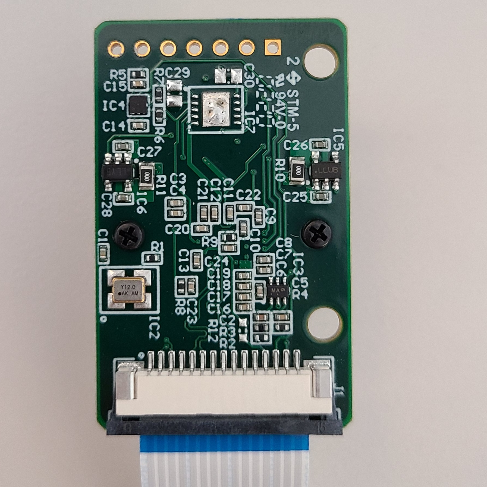

2. Connect the CSI ribbon cable to the CSI connector J8 on the MAX78002EVKIT.

    Slide out the thin darker part of the connector to open it, then insert the ribbon cable.

    The blue strip of the ribbon cable should be facing up.

    Snap the thin darker part of the connector to close it and lock the cable in place.

    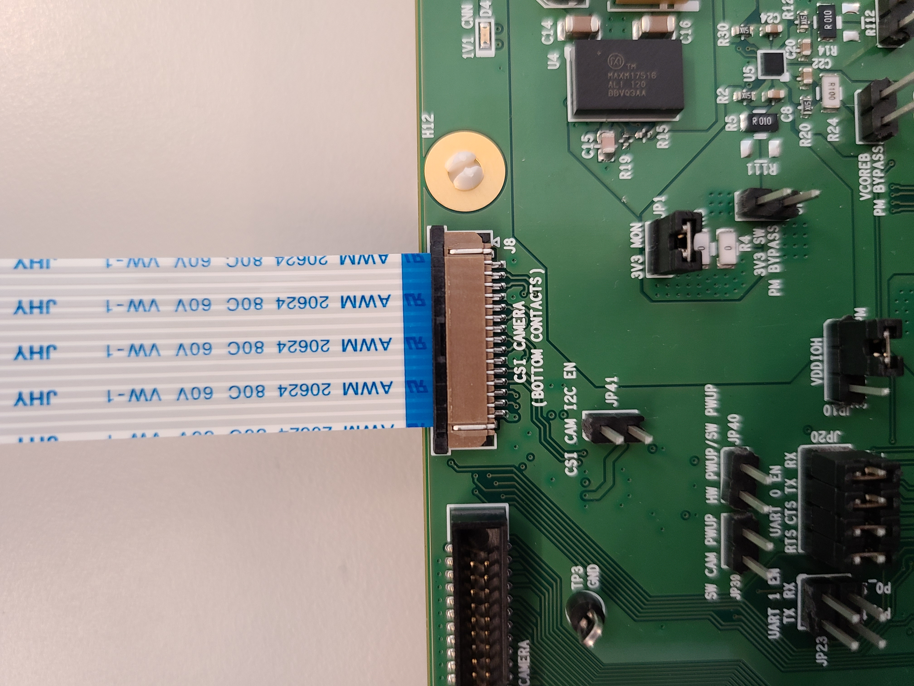

3. Remove the cap from the CSI camera module before using it.

    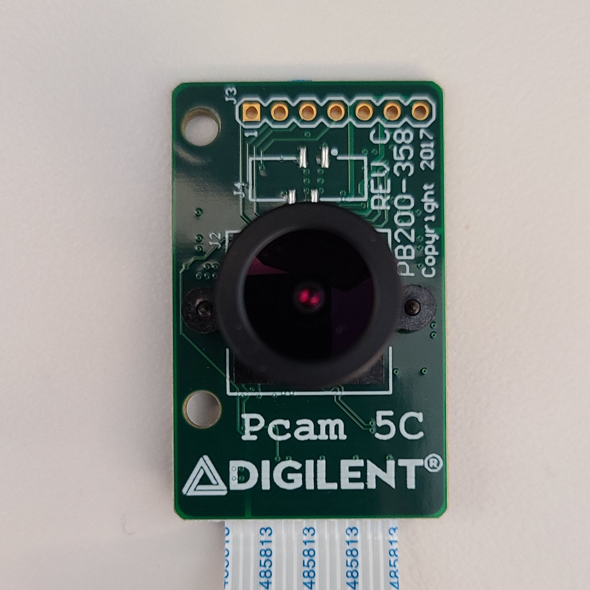

#### OVM7692

The MAX78002EVKIT also comes with an OVM7692 DVP (Digital Video Port) camera module, which should be connected to the DVP connector JH7 for evaluation. This camera also requires an external adapter board which is included with the MAX78002EVKIT.

1. Insert the OVM7692 camera module into JH2 on the DVP adapter board.

    The camera module should be facing toward the outer edge of the adapter board.

    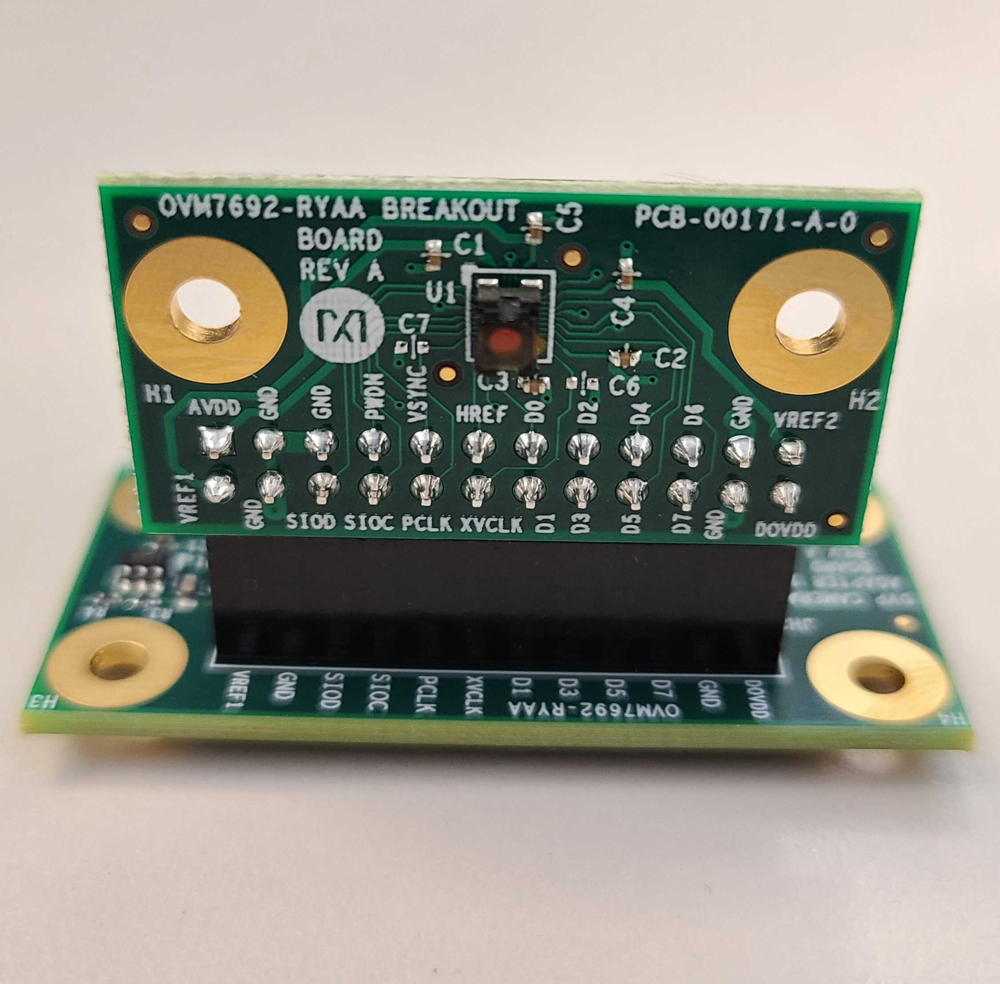

    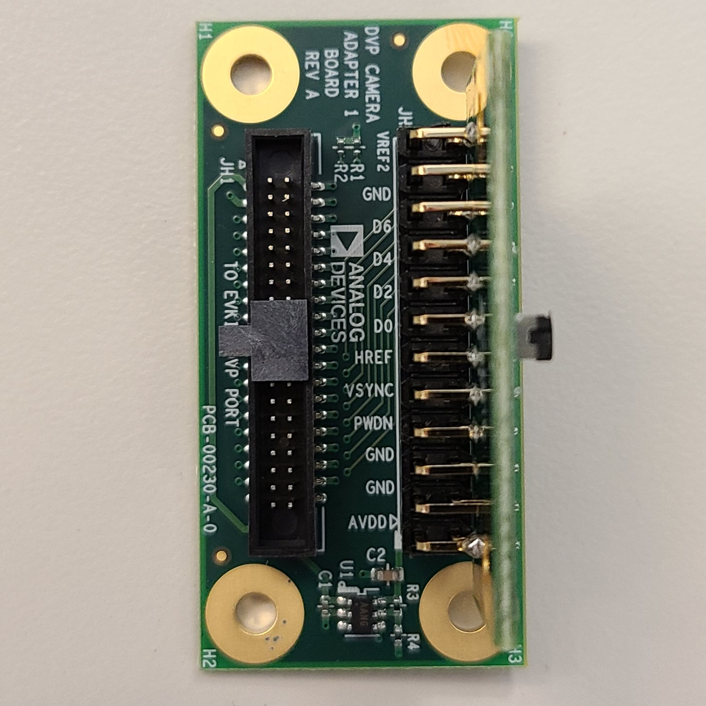

2. Remove the small amber cover sticker from the OVM7692 camera module to expose the lens.

    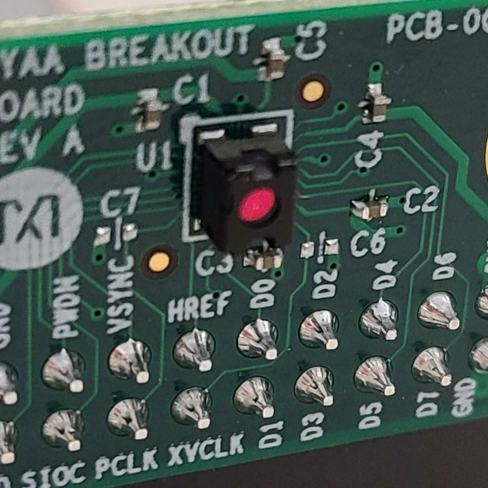

3. Remove the plastic cover from the DVP port of the adapter board and attach one side of the included DVP cable.

    Use the end of the cable with the notch such that the cable comes out from the adapter board.

    

4. Attach the other side of the DVP cable to JH7 on the MAX78002EVKIT.

    **It should be noted that removing the cable after fully inserting it into JH7 can very easily damage it.** To safely remove the DVP cable use a small flat-head to push out the plastic notch. **Do no remove the cable by pulling on the cable wire itself.**

    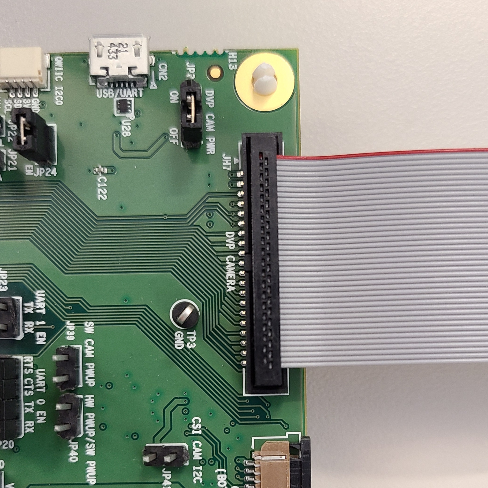

## First-time Operation

The MAX78002EVKIT will come pre-flashed with a Keyword-spotting demo program out of the box. This demo showcases the “kws20” Neural Network, which has been trained on Google’s speech commands dataset to recognize the following 20 keywords:

 up, down, left, right, stop, go, yes, no, on, off, one, two, three, four, five, six, seven, eight, nine, zero

To excercise the demo power on the EVKIT and follow the instructions on the TFT display.

Optionally, connect to the USB/UART (CN2) [Serial port](#connecting-serial-ports) to monitor the serial output of the demo program.

The source code for the demo can be found in the `Examples/MAX78002/CNN/kws20_demo` folder of the MSDK.

## Software Development Quick-Start

### Setup

Embedded development for the MAX78002EVKIT is enabled by the MSDK.

The Analog Devices MSDK can be downloaded and installed from the following links:

    * [Windows](https://www.analog.com/en/design-center/evaluation-hardware-and-software/software/software-download?swpart=SFW0010820A)
    * [Ubuntu Linux](https://www.analog.com/en/design-center/evaluation-hardware-and-software/software/software-download?swpart=SFW0018720A)
    * [macOS](https://www.analog.com/en/design-center/evaluation-hardware-and-software/software/software-download?swpart=SFW0018610A)

More detailed setup instructions for the MSDK can be found in the “Embedded Software Development Kit (MSDK)” section of the ai8x-synthesis readme [here](https://github.com/MaximIntegratedAI/ai8x-synthesis/blob/develop/README.md#embedded-software-development-kit-msdk).

### Example Projects

Example projects for the MAX78002EVKIT can be found in the `MaximSDK/Examples/MAX78002` folder of the MSDK installation.

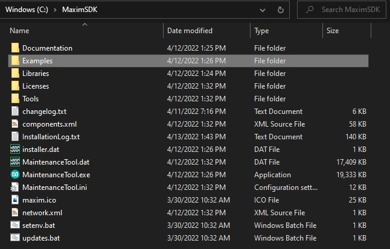

Each example project contains a `README.md` file explaining what the example does. “Out of the box” each example is set up for command-line development, Visual Studio Code, and Eclipse. In general, the examples are organized into folder names that are based on the peripheral that it demonstrates.

### MSDK Documentation and Peripheral API

Additional documentation on the MAX78002’s peripheral API and example projects can be found by opening the `MaximSDK/Documentation/MAX78002.html` file in your browser. This root file contains shortcuts to documentation on the peripheral API, toolchain documentation, example applications, datasheets, and schematics.

The peripheral API documentation is particularly useful and contains full module references. This document is useful to reference when examining the MAX78002 example projects and/or developing new projects around the peripheral drivers.

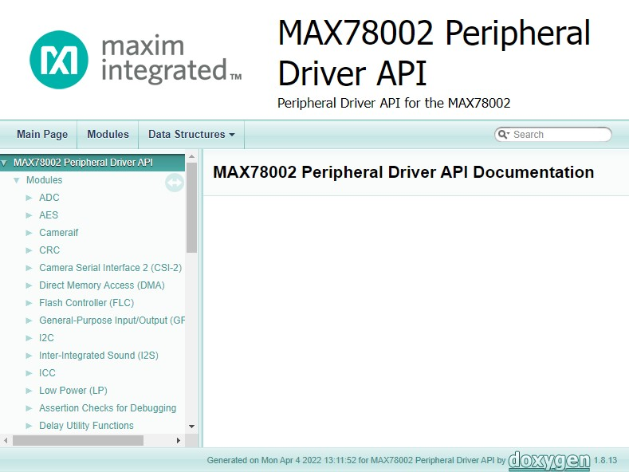

### Debugger Limitations of the MAX78002

Before continuing into the development quick-starts below, it’s important to note some limitations when debugging the MAX78002:

* The debugger can not be connected to the MAX78002 _while_ the device is in reset.
* The MAX78002 can not be debugged while the device is in Sleep, Low Power Mode, Micro Power Mode, Standby, Backup, or Shutdown mode.

    These modes shut down the SWD clock.

    Examples that enter these modes have a 2-second delay in place at the beginning of code execution to give the debugger a window to connect. For low-power development, it is also recommended to have the same delay in place.

These limitations may make the device difficult (or impossible) for the debugger to connect in certain states. In such cases, the device can be recovered from the “locked out” firmware by erasing the application-space in the flash memory bank. See [How to Unlock a MAX78000 That Can No Longer Be Programmed](#how-to-unlock-a-max78002-that-can-no-longer-be-programmed).

### Command-Line Development

This section demonstrates how to build the MSDK example projects for the MAX78002EVKIT on the command line. It also demonstrates how to flash and debug over the command-line.

This section is presented first because all of the IDEs supported by the MSDK rely on a functional command-line toolchain. Familiarity with the inner workings of the command-line can facilitate better experiences with the IDEs. However, this is by no means required reading to use those IDEs.

#### Building Examples

The MSDK build system is a managed system that uses GNU Make. Every example project contains a `Makefile` that is used to build the source code. The [GNU Make manual](https://www.gnu.org/software/make/manual/make.html) is a good document to bookmark when working with Makefiles. The example projects in the `Examples/MAX78002` directory of the MSDK contain Makefiles that are preconfigured for the MAX78002EVKIT.

1. First, copy the example project to an accessible directory outside of the MSDK. It is strongly recommended to keep the MSDK examples “clean” and unmodified in case they need to be referenced again later.

2. Launch your terminal. On Windows, use the `MaximSDK/Tools/MSYS2/msys.bat` file to launch the MSYS2 terminal, which auto-configures the terminal for the MSDK toolchain. On Linux and MacOS, you should have set up the toolchain for your terminal as part of the setup procedure.

3. `cd` into the location of the copied example project.

4. Run the following command to build the example:

    ```shell
    make -r -j 8 all
    ```

    * “-r” is an option that improves build speed.
    * “-j 8” enabled parallel execution of the build in 8 threads. In general, this number should be double the number of cores on your machine.
    * “all” is the target for building “all” of the source code.

5. You’ll see the source code for the project and the MSDK peripheral drivers being compiled on the terminal output. Finally, the compiled source code will be linked into the build output file (`build/max78002.elf`).

6. The example project is now successfully built and ready to flash and debug.

#### Flashing Examples

1. First, build the example project if you have not done so already (See the section above).

2. Connect the PICO debugger to the SWD debugger port (See [Connecting Debug Adapters](#connecting-debug-adapters)).

3. Launch your terminal. On Windows, use the `MaximSDK/Tools/MSYS2/msys.bat` file to launch the MSYS2 terminal.

4. `cd` into the location of the copied example project.

5. Run the one of the following commands to flash the program with OpenOCD.

    * Flash and exit:

        ```shell
        openocd -s $MAXIM_PATH/Tools/OpenOCD/scripts -f interface/cmsis-dap.cfg -f target/max78002.cfg -c "program build/max78002.elf verify exit"
        ```

        Use this command if you just want to flash the program. OpenOCD will exit on completion.

        Expected output:

        ```shell
        Open On-Chip Debugger 0.11.0+dev-g4cdaa275b (2022-03-02-09:57)
        Licensed under GNU GPL v2
        For bug reports, read
            http://openocd.org/doc/doxygen/bugs.html
        DEPRECATED! use 'adapter driver' not 'interface'
        Info : CMSIS-DAP: SWD supported
        Info : CMSIS-DAP: Atomic commands supported
        Info : CMSIS-DAP: Test domain timer supported
        Info : CMSIS-DAP: FW Version = 0256
        Info : CMSIS-DAP: Serial# = 044417016af50c6500000000000000000000000097969906
        Info : CMSIS-DAP: Interface Initialised (SWD)
        Info : SWCLK/TCK = 1 SWDIO/TMS = 1 TDI = 0 TDO = 0 nTRST = 0 nRESET = 1
        Info : CMSIS-DAP: Interface ready
        Info : clock speed 2000 kHz
        Info : SWD DPIDR 0x2ba01477
        Info : max32xxx.cpu: Cortex-M4 r0p1 processor detected
        Info : max32xxx.cpu: target has 6 breakpoints, 4 watchpoints
        Info : starting gdb server for max32xxx.cpu on 3333
        Info : Listening on port 3333 for gdb connections
        Info : SWD DPIDR 0x2ba01477
        target halted due to debug-request, current mode: Thread
        xPSR: 0x81000000 pc: 0x0000fff4 msp: 0x20003ff0
        ** Programming Started **
        ** Programming Finished **
        ** Verify Started **
        ** Verified OK **
        shutdown command invoked
        ```

    * Flash and hold:

        ```shell
        openocd -s $MAXIM_PATH/Tools/OpenOCD/scripts -f interface/cmsis-dap.cfg -f target/max78002.cfg -c "program build/max78002.elf verify; init; reset halt"
        ```

        Use this if you want to also debug the program. OpenOCD will flash the program, reset the MAX78002, and wait for a GDB debugger client connection.

        Expected output:

        ```shell
        Open On-Chip Debugger 0.11.0+dev-g4cdaa275b (2022-03-02-09:57)
        Licensed under GNU GPL v2
        For bug reports, read
            http://openocd.org/doc/doxygen/bugs.html
        DEPRECATED! use 'adapter driver' not 'interface'
        Info : CMSIS-DAP: SWD supported
        Info : CMSIS-DAP: Atomic commands supported
        Info : CMSIS-DAP: Test domain timer supported
        Info : CMSIS-DAP: FW Version = 0256
        Info : CMSIS-DAP: Serial# = 044417016af50c6500000000000000000000000097969906
        Info : CMSIS-DAP: Interface Initialised (SWD)
        Info : SWCLK/TCK = 1 SWDIO/TMS = 1 TDI = 0 TDO = 0 nTRST = 0 nRESET = 1
        Info : CMSIS-DAP: Interface ready
        Info : clock speed 2000 kHz
        Info : SWD DPIDR 0x2ba01477
        Info : max32xxx.cpu: Cortex-M4 r0p1 processor detected
        Info : max32xxx.cpu: target has 6 breakpoints, 4 watchpoints
        Info : starting gdb server for max32xxx.cpu on 3333
        Info : Listening on port 3333 for gdb connections
        Info : SWD DPIDR 0x2ba01477
        target halted due to debug-request, current mode: Thread
        xPSR: 0x81000000 pc: 0x0000fff4 msp: 0x20003ff0
        ** Programming Started **
        ** Programming Finished **
        ** Verify Started **
        ** Verified OK **
        Info : Listening on port 6666 for tcl connections
        Info : Listening on port 4444 for telnet connections <-- Note: OpenOCD is now waiting for a GDB client
        ```

#### Debugging Examples

1. Flash the example program using the “Flash and hold” command above if you have not done so already.

2. Launch a _new_ terminal. On Windows, use the `MaximSDK/Tools/MSYS2/msys.bat` file to launch a new MSYS2 terminal.

3. `cd` into the location of the copied example project. The next steps will use the “Hello World” project as an example.

4. Run the following command to launch a GDB client.

    ```shell
    arm-none-eabi-gdb --se=build/max78002.elf
    ```

    * “--se” sets the symbol and executable file to the compiled program file. If you’ve changed the name of the output file the command above should change accordingly.

    Expected output:

    ```shell
    GNU gdb (GNU Arm Embedded Toolchain 10.3-2021.10) 10.2.90.20210621-git
    Copyright (C) 2021 Free Software Foundation, Inc.
    License GPLv3+: GNU GPL version 3 or later <http://gnu.org/licenses/gpl.html>
    This is free software: you are free to change and redistribute it.
    There is NO WARRANTY, to the extent permitted by law.
    Type "show copying" and "show warranty" for details.
    This GDB was configured as "--host=i686-w64-mingw32 --target=arm-none-eabi".
    Type "show configuration" for configuration details.
    For bug reporting instructions, please see:
    <https://www.gnu.org/software/gdb/bugs/>.
    Find the GDB manual and other documentation resources online at:
      <http://www.gnu.org/software/gdb/documentation/>.

    For help, type "help".
    Type "apropos word" to search for commands related to "word"...
    Reading symbols from build/max78002.elf...
    (gdb)
    ```

5. Next, connect to the OpenOCD server that is running in the other terminal window with the following command.

    ```shell
    target extended-remote localhost:3333
    ```

    Expected output:

    ```shell
    Remote debugging using localhost:3333
    0x0000fff4 in ?? () <-- Note: ?? may be present at this stage, which is OK.
    ```

6. (Optional) Reset the MAX78002.

    ```shell
    monitor reset halt
    ```

    If you have just come from running the “Flash and hold” command, the MAX78002 should already be reset and halted.
    However, it is always good practice to reset and halt the micro core before debugging.

    Expected output:

    ```shell
    SWD DPIDR 0x2ba01477
    target halted due to debug-request, current mode: Thread
    xPSR: 0x81000000 pc: 0x0000fff4 msp: 0x20003ff0
    ```

7. Set a breakpoint on main.

    ```shell
    b main
    ```

    Expected output:

    ```shell
    Breakpoint 1 at 0x10000224: file main.c, line 62.
    Note: automatically using hardware breakpoints for read-only addresses.
    ```

8. Continue the debugger.

    ```shell
    continue
    ```

    Expected output (for the Hello World example):

    ```shell
    Continuing.

    Breakpoint 1, main () at main.c:62
    62     printf("Hello World!\n");
    ```

9. (Optional) Continue debugging.

    At this stage, the debugger is connected properly and the program is halted on the `main` function.
    You can continue debugging freely from here.
    See [Common GDB Commands](#Common GDB Commands) below for a quick reference

10. Quit GDB.

    ```shell
    quit
    ```

    Expected output:

    ```shell
    A debugging session is active.

      Inferior 1 [Remote target] will be detached.

    Quit anyway? (y or n) [answered Y; input not from terminal]
    Detaching from program: C:\Users\Jake.Carter\codespace\Hello_World\build\max78002.elf, Remote target
    [Inferior 1 (Remote target) detached]
    ```

11. Quit OpenOCD. In the terminal window running OpenOCD, press “CTRL + C” to issue the shutdown command.

#### Common GDB Commands

| **Command**                    | **Short Command** | **Description**                                              |
| ------------------------------ | ----------------- | ------------------------------------------------------------ |
| monitor halt                   |                   | Halt the microcontroller.                                    |
| monitor reset halt             |                   | Reset the microcontroller and immediately halt.              |
| monitor max32xxx mass\_erase 0 |                   | Mass erase the flash.                                        |
| file \<filename\>              |                   | Set the program file to debug                                |
| load                           |                   | Flash the current program file                               |
| continue                       | c                 | Continue execution.                                          |
| break \<arg\>                  | b \<arg\>         | Set a breakpoint. Argument can be function\_name, file:line\_number, or \*address. |
| print \<variable\>             | p                 | Print the value of a variable. Variable must be in current scope. |
| backtrace                      | bt                | Print contents of the stack frame.                           |
| step                           | s                 | Execute the next instruction.                                |
| next                           | n                 | Execute the next line of code.                               |
| finish                         | f                 | Continue to the end of the current function.                 |
| info reg                       |                   | Print the values of the ARM registers.                       |
| help                           |                   | Print descriptions for available commands                    |
| help \<cmd\>                   |                   | Print description for given command.                         |
| quit                           | q                 | Quit the GDB client                                          |

### Developing with Visual Studio Code

The MSDK includes Visual Studio Code (“VS Code”) support via the [VSCode-Maxim](https://github.com/MaximIntegratedTechSupport/VSCode-Maxim) project.

All MAX78002 example projects come “out of the box” with the latest VSCode-Maxim project files and documentation. These can be found in the `.vscode` folder inside each example. The example projects all come pre-configured for the MAX78002EVKIT by default. However, some basic one-time setup is required for Visual Studio Code:

#### VSCode-Maxim Setup

Follow the [installation instructions](https://github.com/MaximIntegratedTechSupport/VSCode-Maxim#installation) from the VSCode-Maxim readme. This is a required step to use the VSCode-Maxim project files.

#### Opening Example Projects

1. First, copy the example project from the `Examples/MAX78002` folder in the MSDK installation to an accessible directory outside of the MSDK. It is strongly recommended to keep the MSDK examples “clean” and unmodified in case they need to be referenced again later.

2. Launch Visal Studio Code. You should have already configured VS Code for use with the MSDK as part of the setup procedure. If not, follow the Setup section above before continuing.

3. Navigate to “File -> Open Folder...”

    

4. Navigate to the location of the copied example project from step 1 and hit “Select Folder”.

5. The project should now be opened in Visual Studio Code. For example:

    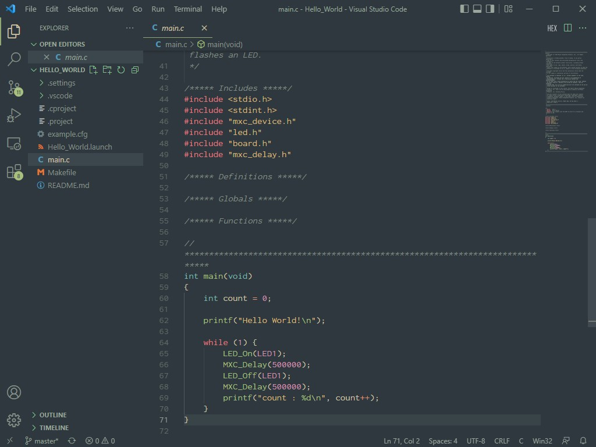

6. Documentation (`readme.md`) and settings files can be found in the `.vscode` sub-folder of the example project.

    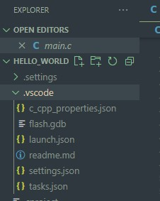

#### VSCode-Maxim Usage

Detailed usage instructions can be found in the [Usage](https://github.com/MaximIntegratedTechSupport/VSCode-Maxim#usage) section of the VSCode-Maxim readme.

Additionally, a full [User Guide](https://github.com/MaximIntegratedTechSupport/VSCode-Maxim/blob/main/userguide.md) is available.

### Developing with Eclipse

#### Eclipse Setup

The only setup required to use Eclipse is to ensure that the “Eclipse” component is selected during the MSDK installation. If the MSDK is already installed, the component can be added by launching the “MaintenanceTool” application in the root directory of the MSDK and selecting “Add or the remove components”.

#### Running Eclipse

If you are using Microsoft Windows, you must launch Eclipse from the _Windows Start Menu_ or the `MaximSDK/Tools/Eclipse/cdt/eclipse.bat` file. This `eclipse.bat` file calls the `setenv.bat` script in the root directory of the MSDK before launching Eclipse, which makes the MSDK toolchain accessible. Eclipse will fail to find the MSDK toolchain binaries unless it is launched with this method.

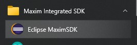

#### Importing an Example

1. Launch Eclipse.

2. Use “File -> Import” to open the import wizard.

3. Select “General -> Existing Projects into Workspace” and hit “Next”.

    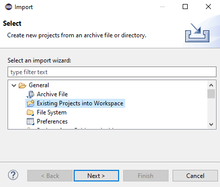

4. “Select root directory” and hit the “Browse” button.

    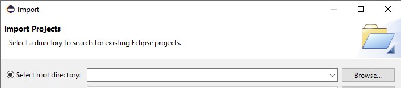

5. Browse to the `Examples/MAX78002` folder in the MSDK installation, and then into the example project you would like to import.

    For example, the `Hello_World` Project:

    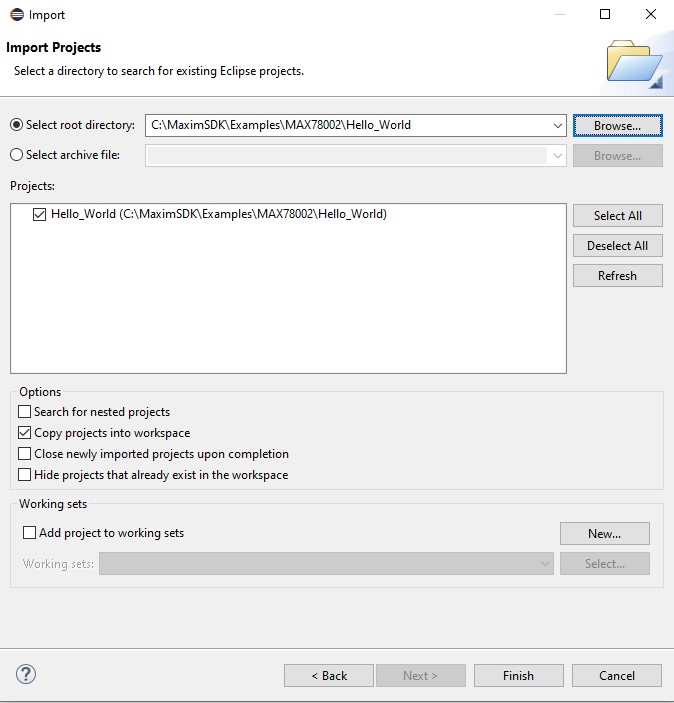

    or the Keyword-Spotting (`kws20_demo`) CNN project. CNN projects are found in the `CNN` subfolder.

    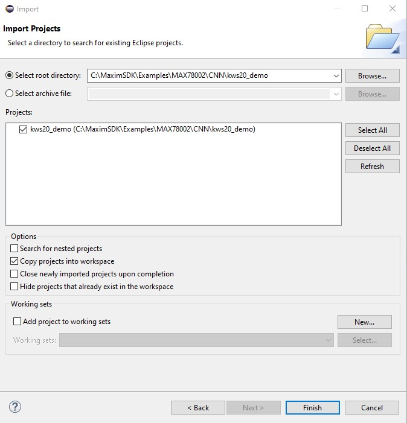

6. Ensure that “Copy projects into workspace” is always selected when you import. This will ensure that the MSDK copy of the example remains “clean” and unmodified.

    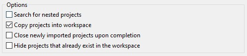

7. Select “Finish” to import the project.

8. It should now show up in the Project Explorer.

    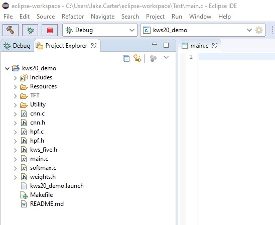

9. The Eclipse projects files are configured for the MAX78002EVKIT by default. This can be verified by opening the project properties and navigating to “C/C++ Build -> Environment”:

    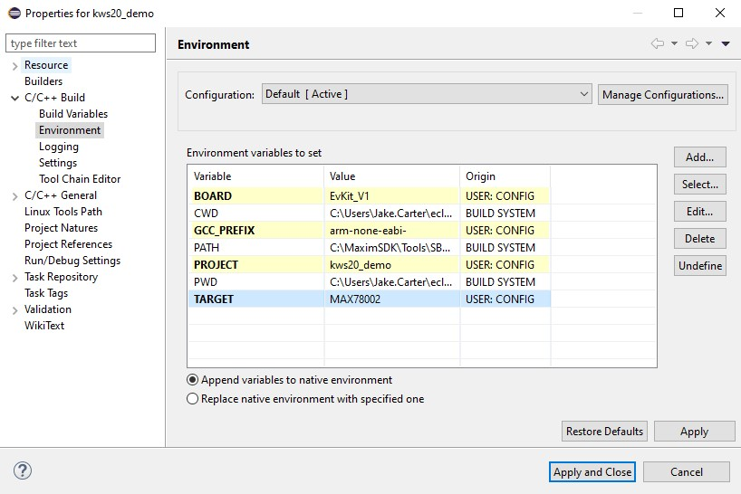

    * `BOARD` should be set to `EvKit_V1`
    * `TARGET` should be set to `MAX78002`

10. The example is now successfully imported. From here, you may edit, build, and debug the project.

#### Creating a New Project

1. Launch Eclipse

2. Ensure that the Eclipse is set to the C/C++ perspective in the top right corner. Otherwise, the new project wizard will not show up.

    

3. Navigate to “File -> New -> Maxim Microcontrollers”.

    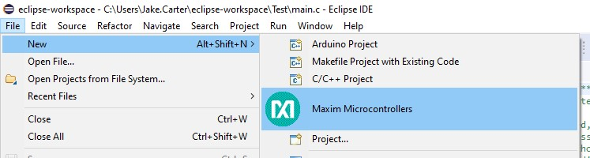

4. Enter the project name and hit “Next”.

    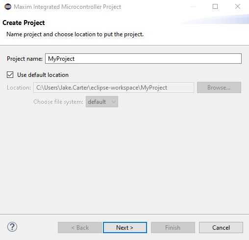

5. Enter the following settings, optionally changing the “Select example type” option to change the example that the new project will copy.

    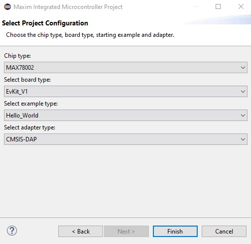

6. Select “Finish” to create the new project. From here, you may edit, build, and debug the project.

#### Building a Project

Use the “Build” button in the top left corner of the window to build a project in Eclipse.

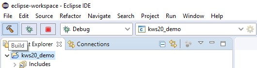

Eclipse will use the project Makefile with the “make” command set in “C/C++ Build” project properties setting.

As shown below, the default “make” target is “all”.

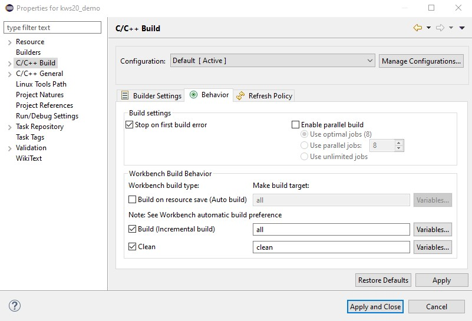

#### Debugging

Ensure that you have connected your debugger and powered on the MAX78002EVKIT before proceeding. See [Connecting Debug Adapters](#connecting-debug-adapters).

A project can be debugged by clicking the “Debug” button in the top left corner of the window, next to the “Build” button. This button will launch the currently selected debug configuration (circled in blue below). It is important to ensure that the debug configuration you have selected matches the project you would like to debug.

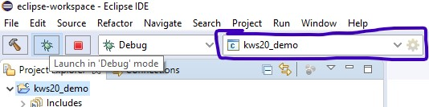

The debugger can be stopped with the red “Stop” button next to the “Debug” button.

#### Additional Usage Info for Eclipse

Additional usage information for Eclipse can be found in the [Getting Started with Eclipse](https://www.analog.com/media/en/technical-documentation/user-guides/getting-started-with-eclipse.pdf) document.

---


### How to Unlock a MAX78002 That Can No Longer Be Programmed

Some [debugger limitations](#debugger-limitations-of-the-max78002) may make the device difficult to connect to. In such cases, the device can be recovered from the “locked out” firmware by erasing the application-space in the flash memory bank.

Before following the procedure below, ensure that you have updated the PICO debugger firmware to the latest version. See [Updating the MAX32625PICO (PICO) Debug Adapter Firmware](#updating-the-max32625pico-pico-debug-adapter-firmware)

1. Connect the PICO debugger to the MAX78002 EVKIT SWD debugger port. See [Connecting Debug Adapters](#connecting-debug-adapters) for more detailed instructions on this step.

2. Connect the PICO debugger to the host PC with the included micro-USB cable.

3. Open the DAPLINK` drive on the host PC.

    

4. Open the `DETAILS.TXT` inside of the `DAPLINK` drive in a text editor.

    

5. Verify that the “Automation allowed” field is set to 1.

    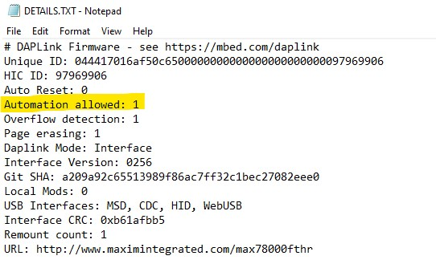

    If this field is _not_ set to 1, follow the procedure below:

    1. Create a new _empty_ file, and save it as `auto_on.cfg`.

    2. Press and hold the pushbutton on top of the PICO.

        

    3. _While holding the pushbutton_, drag and drop the `auto_on.cfg` file onto the `DAPLINK` drive.

        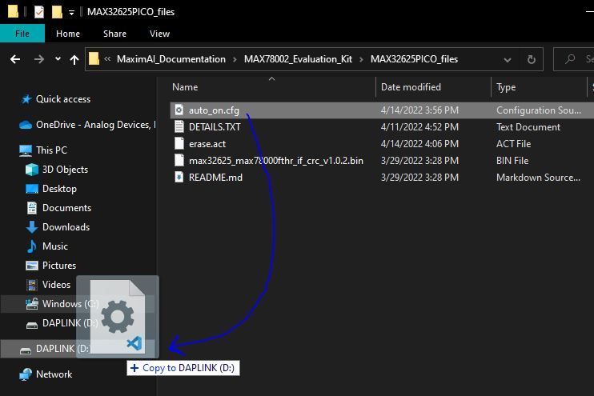

    4. Continue holding the pushbutton until the file is finished transferring over, then release it.

    5. The PICO should power cycle, and the DAPLINK drive should re-appear with “Automation allowed” set to 1.

6. Power on the MAX78002EVKIT (if it isn’t already).

7. Drag and drop the [`MAX32625PICO_files/erase.act`](https://github.com/MaximIntegratedAI/MaximAI_Documentation/raw/master/MAX78002_Evaluation_Kit/MAX32625PICO_files/erase.act) file onto the `DAPLINK` drive.

    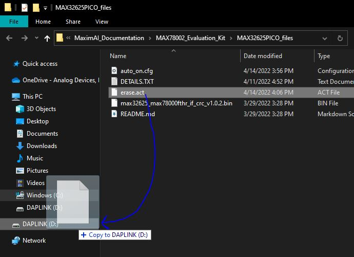

8. The PICO debugger will mass erase the MAX78002’s application-space flash bank, which will completely wipe any application firmware that is programmed on the device.

9. Power cycle the MAX78002EVKIT. The MAX78002 is now blank and ready to re-program. The debugger should have no issues connecting to the device in this blank state.

Note:  In order to avoid the locked out state to begin with, it is recommended that during code development, a delay be placed at the beginning of user code in order to give the debug adapter an opportunity to communicate with or halt the processor. A delay of 2 seconds is ideal so that the debugger can be attached manually.

## Power Monitor Sub-Circuit

The MAX78002EVKIT includes a dedicated power-monitoring sub-circuit (PMON) that allows the user to measure the power consumption of the MAX78002 to determine the active and idle power, and the energy and time to perform CNN inferences as well as kernel and data loading. This separate sub-circuit can be found in the bottom right corner of the board and has its own TFT display, USB virtual serial port, and microcontroller.


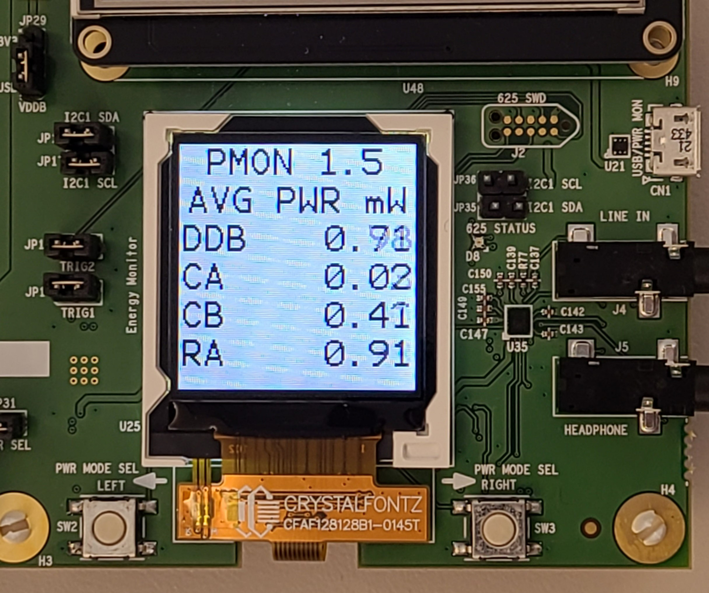


The PMON firmware version can be checked by repeatedly pressing either the PWR MODE SEL LEFT or RIGHT button to cycle through the screens to view the information page. 


At the time of this writing, latest version of the power monitor sub-circuit’s firmware is v2.0. Check the reported version against the latest MAX78002EVKIT PMON firmware available [HERE](https://github.com/MaximIntegratedAI/MaximAI_Documentation/tree/master/MAX78002_Evaluation_Kit/PMON_Firmware) 

Detailed usage information on the PMON operation, including measurements, how to instrument code and updating the firmware is available in the [MAX7800x Power Monitor and Energy Benchmarking Guide](https://github.com/MaximIntegratedAI/MaximAI_Documentation/blob/master/Guides/MAX7800x%20Power%20Monitor%20and%20Energy%20Benchmarking%20Guide.md).

## Machine Learning (ML) Development

The quick-start development sections aboved have covered the "embedded" side of development with the MAX78002EVKIT. This includes working with example projects, peripheral driver APIs, and the IDEs and toolchain supported by the MSDK.

As the MAX78002 contains a powerful Convolution Neural Network (CNN) accelerator, there is also the Machine Learning side of development with the part. This is done with a separate set of tools. The example projects that are found in the `CNN` sub-folder of the MAX78002 examples have been created with these tools. More specifically, they have been created with the `ai8x-synthesis` (“izer”) tool, which converts a trained model into C code that can be compiled and flashed onto the MAX78002 using the “embedded” development methods discussed in this document.

### ML Overview

The documentation associated with the setup and usage of these tools is significant. Here are the links to get started:

* [Analog Devices AI Github Repository](https://github.com/maximintegratedAI)
* [ai8x-synthesis tool](https://github.com/MaximIntegratedAI/ai8x-synthesis)
* [ai8x-training tool](https://github.com/MaximIntegratedAI/ai8x-training)
* [Workflow Guide](https://github.com/MaximIntegratedAI/MaximAI_Documentation/blob/master/Guides/MAX78000_Workflow_Guide.md#max78000-workflow-guide)

### ML Videos

A large technical library of technical training videos on Artificial Intelligence (AI) and the MAX78000/MAX78002 is available via the links below. These are the best way to get started with ML on the MAX78002.

* [Artificial Intelligence Videos Page](https://www.analog.com/en/education/education-library/videos/6313215159112.html)
* The “Understanding Artifical Intelligence” series is highly recommended for all developers.

### ML Setup

The setup and usage of the machine learning tools is thoroughly documented in the [README.md](https://github.com/MaximIntegratedAI/ai8x-synthesis/blob/develop/README.md) file that can be found in the root directory of both the “izer” and training tools. See the [Installation](https://github.com/MaximIntegratedAI/ai8x-training/blob/develop/README.md#installation) section for detailed instructions.

### ML Usage

Detailed usage of the “izer” and training tools is beyond the scope of this document. The [Workflow Guide](https://github.com/MaximIntegratedAI/MaximAI_Documentation/blob/master/Guides/MAX78000_Workflow_Guide.md) is a great introduction, and the [Videos](https://www.analog.com/en/education/education-library/videos/6313215159112.html) dive deeper.

Additionally, the [README](https://github.com/MaximIntegratedAI/ai8x-synthesis/blob/develop/README.md) contains all of the usage information for the tools.

Below are a few excercises to get started after setup is complete:

* Run the `gen-demos-max78002.sh` script found in the root directory of the “izer” tool and reference its [Command Line Arguments](https://github.com/MaximIntegratedAI/ai8x-synthesis#command-line-arguments-3) table to see how it works.

* Build and flash the output of one of the `gen-demos-max78002.sh` projects and verify that the generated “known answer” test passes.

* Locate the YAML files for the pre-trained models in the “izer” tool and reference the [YAML Network Description](https://github.com/MaximIntegratedAI/ai8x-synthesis#yaml-network-description) to see how they work.

* Run `train_all_models.sh` from the training repository and reference its [Command Line Arguments](https://github.com/MaximIntegratedAI/ai8x-training#command-line-arguments) to see how it works.

* Familiarize yourself with the concept of [Data Loaders](https://www.analog.com/en/app-notes/data-loader-design-for-max78000-model-training.html) and explore the pre-written data loaders found in the [datasets](https://github.com/MaximIntegratedAI/ai8x-training/tree/develop/datasets) directory of the training tool.
